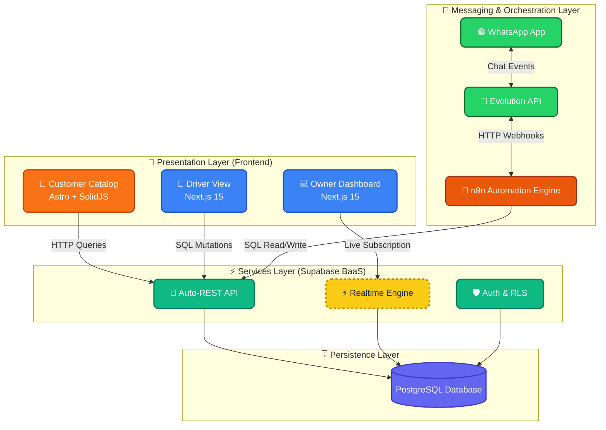

<div align="center">
  🌎 <a href="README.md">Español</a> | <a href="README.pt-br.md">Português do Brasil</a> | <b>English</b>
</div>

---

<div align="center">
  
  
  # Center Gás Curitiba
  **Digital Transformation & Last-Mile Logistics Platform**
  
  [](https://github.com/arcavcwb/center-gas)
  [](#)
  [](docs/15-agentic-flow-manual.md)
  [](#)
</div>

---

## 🚀 The Vision
Center Gás Curitiba is a local gas (P13) and water (20L) delivery company. The mission of this platform is to **transform a manual WhatsApp-based operation** into an automated digital ecosystem, reducing manual data entry, improving the customer experience, and providing real-time telemetry to the owner and delivery drivers.

---

## 🤖 The Agentic Squad (Zero-Trust)
This repository is not a traditional software project. It is governed and developed by a **Squad of 10 autonomous AI Agents** orchestrated under a strict **Zero-Trust** philosophy.

### The Governance Triangle
- 📋 **Plane (Source of Truth):** Where the business lives, the requirements (Issues), and the agents' logs.
- 🔀 **Git/GitHub (Incorruptible Judge):** Where code is automatically audited before reaching Production.
- 👤 **The Human (Final Authority):** Who defines rules, opens Gates, and makes strategic decisions.

### Our 10 Agents
| Specialty | Agent (ID) | Assigned Model |
|---|---|---|
| 🏛️ **Architecture** | `@architect-agent` | 👑 `claude-3-opus` |
| 🛡️ **Security / Review** | `@pr-reviewer-agent` | ⚡ `gemini-3.6-flash` |
| 🧪 **QA & Testing** | `@qa-agent` | 🟠 `claude-3.5-sonnet` |
| 💻 **Frontend Dev** | `@frontend-dev-agent` | 🟠 `claude-3.5-sonnet` |
| 💾 **Backend & DB** | `@backend-dev-agent` | 🟠 `claude-3.5-sonnet` |
| 🎨 **UI/UX Design** | `@designer-agent` | 🟠 `claude-3.5-sonnet` |
| 📈 **Product Owner** | `@po-agent` | 🟠 `claude-3.5-sonnet` |
| ⏱️ **Scrum Master** | `@scrum-master-agent` | 🟠 `claude-3.5-sonnet` |
| ⚙️ **DevOps & CI/CD** | `@devops-agent` | 🟠 `claude-3.5-sonnet` |
| 🤖 **Automation** | `@automation-agent` | 🟠 `claude-3.5-sonnet` |

> 📖 **Recommended Reading:** Learn the details of this orchestration in the [Agentic Flow Manual (docs/15)](docs/15-agentic-flow-manual.md).

---

## 🏗️ Technical Architecture (Stack)
- **Frontend App (Customer):** `Astro` + `SolidJS` (Focused on extreme speed and low JS).
- **Frontend Dashboard (Admin/Driver):** `Next.js 15` (App Router) + `TailwindCSS` (Shadcn/UI).
- **Backend & Authentication:** `Supabase` (PostgreSQL, RLS, Edge Functions, Realtime).
- **Automations (WhatsApp/CRM):** `n8n` (Workflows).



---

## 📁 Repository Structure
```text
center-gas-platform/
├── .agents/                 # 🤖 Squad Configuration (agy CLI) & Skills
├── .github/                 # ⚙️ CI/CD Workflows (Zero-Trust pipelines)
├── apps/                    # 💻 Frontend Code (Next.js, Astro) [Coming soon]
├── packages/                # 📦 Shared Zod Contracts [Coming soon]
├── supabase/                # 🗄️ SQL Migrations & RLS [Coming soon]
├── docs/                    # 📚 Structured Documentation (00 to 15)
└── plane/                   # 📋 Plane structure mirrors
```

---

## 🗺️ Documentation Map
The consulting and planning work is already completed and exhaustively documented. No agent assumes information; everything comes from here:

| Doc | Description | Status |
|---|---|---|
| `docs/00` to `docs/05` | Business Analysis (AS-IS, TO-BE, Rules) | ✅ Audited |
| `docs/06-prd.md` | Product Requirements Document | ✅ Validated |
| `docs/08-technical-architecture.md` | Technical Decisions (Stack) | ✅ Validated |
| `docs/09-database-design.md` | Supabase Relational Schema | ✅ Audited |
| `docs/15-agentic-flow-manual.md` | Agent Handoff Protocol | 👑 **Core** |

---

<div align="center">
  <p>Built by <strong>arcavcwb</strong> and the <strong>Antigravity Squad</strong> under a <br/><i>"Plane for the Business, Git for the Code"</i> approach</p>
</div>
