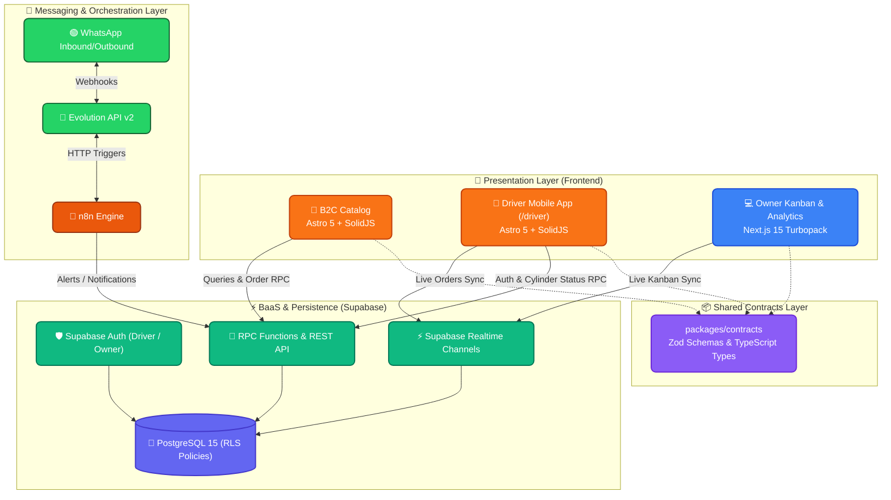

<div align="center">
  <a href="README.md">Español</a> | <a href="README.pt-br.md">Português do Brasil</a> | 🇺🇸 <b>English</b>
</div>

---

<div align="center">
  
  
  # Center Gás Curitiba
  **Digital Transformation & Last-Mile Logistics Platform**
  
  [](https://center-gas-site.vercel.app)
  [](https://vercel.com)
  [](#-technical-architecture-stack)
  [](#-design--experience-impeccable-system)
  [](docs/15-agentic-flow-manual.md)
</div>

---

## 🌐 Live Production Endpoints (Vercel)

| Application | Target Audience | Stack | Production URL |
|---|---|---|---|
| 🛒 **Customer Catalog (B2C)** | End customers in Pinheirinho, Curitiba | Astro 5 + SolidJS | [https://center-gas-site.vercel.app](https://center-gas-site.vercel.app) |
| 🛵 **Driver Mobile App** | Motoboy delivery drivers (Outdoor) | Astro 5 + SolidJS | [https://center-gas-site.vercel.app/driver](https://center-gas-site.vercel.app/driver) |
| 💻 **Dispatch & Kanban Panel (B2B)** | Owner & Warehouse Operations | Next.js 15 (Turbopack) | [https://center-gas-web.vercel.app](https://center-gas-web.vercel.app) |

---

## 🚀 Business Vision & Value Proposition
Center Gás Curitiba is the premier domestic distributor of cooking gas (LPG P13) and 20L mineral water carboys in Pinheirinho (Curitiba - PR, Brazil).

This platform replaces fragmented, manual WhatsApp message capture with a modern, high-availability digital ecosystem:
- **Zero Friction:** Instant-loading mobile web catalog without app store downloads.
- **Smart Combos:** Automatic R$ 5.00 discount when ordering Gas + Mineral Water.
- **24/7 Availability with Scheduling:** Business delivery hours from 08:00 to 20:00; late-night and Sunday orders are scheduled transparently for next business day departure starting at 08:30.
- **Native Bilingual Support:** Instant toggle between Brazilian Portuguese (`pt-BR`) and Spanish (`es`).
- **Cylinder Return Control (BR-002 Rule):** Clear distinction between regular refill exchange and new empty cylinder purchase (+ R$ 200.00 fee).
- **Exact Change Calculation:** Customers choose or type cash amount, and the system computes the exact change needed for the driver.

---

## 🤖 The Zero-Trust Autonomous Agent Squad
This repository is developed and governed by a **Squad of 10 Autonomous AI Agents** operating under a strict **Zero-Trust** philosophy:
- 📋 **Plane (Single Source of Truth):** Where business requirements, epics, issues, and the state machine reside.
- 🔀 **Git/GitHub (Incorruptible Judge):** No direct commits to `main`. Every change flows through feature branches (`feat/ISSUE-XXX`), audited Pull Requests, and squash merges.
- 👤 **The Human (Ultimate Authority):** Approves architectural plans in `implementation_plan.md` and production gates.

### Agent Squad Roster
| Role | Agent (ID) | Assigned Model |
|---|---|---|
| 🏛️ **Architecture** | `@architect-agent` | 👑 `claude-3-opus` |
| 🛡️ **Security / Review** | `@pr-reviewer-agent` | ⚡ `gemini-3.6-flash` |
| 🧪 **QA & Testing** | `@qa-agent` | 🟠 `claude-3.5-sonnet` |
| 💻 **Frontend Dev** | `@frontend-dev-agent` | 🟠 `claude-3.5-sonnet` |
| 💾 **Backend & DB** | `@backend-dev-agent` | 🟠 `claude-3.5-sonnet` |
| 🎨 **UI/UX Design** | `@designer-agent` | 🟠 `claude-3.5-sonnet` |
| 📈 **Product Owner** | `@po-agent` | 🟠 `claude-3.5-sonnet` |
| ⏱️ **Scrum Master** | `@scrum-master-agent` | 🟠 `claude-3.5-sonnet` |
| ⚙️ **DevOps & CI/CD** | `@devops-agent` | 🟠 `claude-3.5-sonnet` |
| 🤖 **Automation** | `@automation-agent` | 🟠 `claude-3.5-sonnet` |

---

## 🏗️ Technical Architecture (Stack)

- **Monorepo:** Managed with `pnpm workspaces` and orchestrated with `Turborepo`.
- **Frontend Catalog & Motoboy (`apps/site`):** `Astro 5` + `SolidJS` reactive islands for near-zero JavaScript footprint and lightning-fast mobile loading.
- **Frontend B2B Dashboard (`apps/web`):** `Next.js 15` (App Router with Turbopack), `React`, `TailwindCSS`, and persistent `Supabase Realtime` subscriptions.
- **Shared Contracts (`packages/contracts`):** Single source of truth containing `Zod` validation schemas and inferred TypeScript types.
- **Backend & BaaS (`supabase/`):** `Supabase PostgreSQL` with Row Level Security (RLS), transactional RPC functions, and live WebSocket channels.
- **WhatsApp Automations:** `n8n` integrated with `Evolution API v2` featuring anti-ban mitigation protocols.



---

## 🎨 Design & Experience: Impeccable System

The entire user interface is audited and hardened against the **Impeccable Design System**:
- **0 Anti-patterns:** 100% compliance on contrast ratios (`WCAG AA`), clear visual hierarchy, and elimination of generic AI habits (`border-l-4`, `gray-on-color`).
- **Pure SVG Iconography:** Zero unicode emojis for action buttons; all interactive triggers use geometric, consistent SVG icons.
- **Mobile Touch Ergonomics:** Minimum **48px touch targets** across the driver application and customer catalog.
- **Brand Palette:**
  - Corporate Flame Orange: `#F6842F`
  - WCAG AA Accessible Orange: `#EA580C`
  - Corporate Blue: `#046BD2`
  - High-contrast Neutrals: `slate-*` palette optimized for sunlight visibility.

---

## 📁 Repository Structure

```text
center-gas-platform/
├── .agents/                 # 🤖 Squad configuration and Antigravity skills
├── .github/                 # ⚙️ CI/CD Workflows (GitHub Actions)
├── apps/
│   ├── site/                # 🛒 B2C Customer Catalog & Driver App (/driver) in Astro + SolidJS
│   ├── web/                 # 💻 B2B Kanban Board, Admin & Metrics in Next.js 15 Turbopack
│   └── e2e/                 # 🧪 End-to-End test suite with Playwright
├── packages/
│   ├── contracts/           # 📦 Shared Zod schemas and TypeScript types
│   └── ui-tokens/           # 🎨 Impeccable design system visual tokens
├── supabase/                # 🗄️ SQL migrations, DDL schemas, and RLS policies
├── docs/                    # 📚 Formal project documentation
│   └── walkthroughs/        # 📝 Exhaustive technical walkthroughs for each PR
├── workflows/               # 🤖 JSON definitions for n8n automations
└── turbo.json               # ⚡ Turborepo monorepo configuration
```

---

## 🧪 Testing & Software Quality

```bash
# Install dependencies with pnpm
pnpm install

# Run unit tests across contracts
pnpm run test:unit

# Build all monorepo packages statically
pnpm build

# Scan UI for Impeccable anti-patterns
./.agent/skills/impeccable/scripts/impeccable detect apps/site/src apps/web/src
```

---

## 🗺️ Documentation Map

| Document | Description | Status |
|---|---|---|
| [`docs/00` to `05`](docs/) | Business Discovery (AS-IS, TO-BE, Business Rules) | ✅ Audited |
| [`docs/06-prd.md`](docs/06-prd.md) | Product Requirements Document | ✅ Completed |
| [`docs/07-ui-ux.md`](docs/07-ui-ux.md) | Impeccable Design System & Interfaces | ✅ Updated |
| [`docs/08-technical-architecture.md`](docs/08-technical-architecture.md) | Software Architecture & Monorepo Topology | ✅ Updated |
| [`docs/09-database-design.md`](docs/09-database-design.md) | PostgreSQL Relational Schema, DDL & RLS | ✅ Audited |
| [`docs/11-roadmap.md`](docs/11-roadmap.md) | Epics and Delivery Roadmap | ✅ Epics 1-5 Done |
| [`docs/13-ai-context-summary.md`](docs/13-ai-context-summary.md) | AI Squad Context Summary | ✅ Synced |
| [`docs/15-agentic-flow-manual.md`](docs/15-agentic-flow-manual.md) | Agent Handoffs & Governance Manual | 👑 **Core** |
| [`docs/VERCEL_DEPLOYMENT_GUIDE.md`](docs/VERCEL_DEPLOYMENT_GUIDE.md) | Dual Vercel Deployment Guide | ✅ Verified |
| [`docs/walkthroughs/`](docs/walkthroughs/) | Exhaustive technical PR reports | 📑 29 Reports |

---

<div align="center">
  <p>Engineered by <strong>arcavcwb</strong> and the <strong>Antigravity Squad</strong> under the philosophy <br/><i>"Plane for the Business, Git for the Code"</i></p>
</div>
