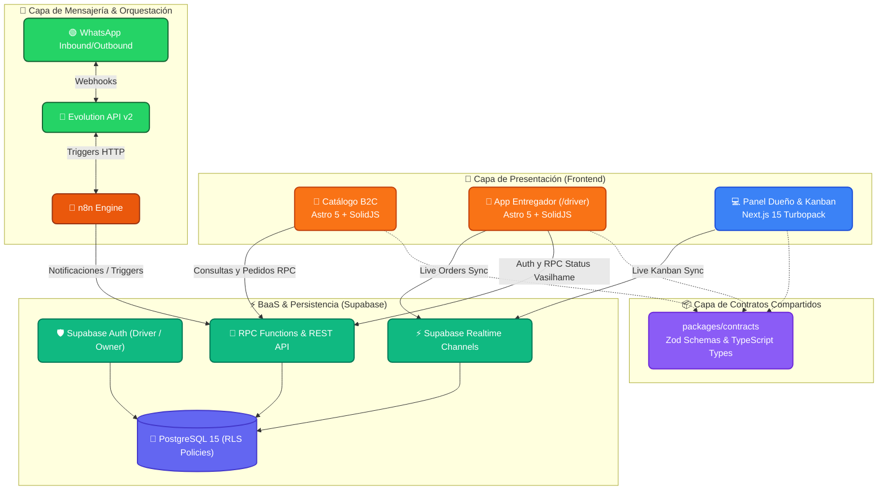

<div align="center">
  🌎 <b>Español</b> | <a href="README.pt-br.md">Português do Brasil</a> | <a href="README.en.md">English</a>
</div>

---

<div align="center">
  
  
  # Center Gás Curitiba
  **Plataforma de Transformación Digital & Logística de Última Milla**
  
  [](https://center-gas-site.vercel.app)
  [](https://vercel.com)
  [](#-arquitectura-técnica-stack)
  [](#-diseño-y-experiencia-impeccable)
  [](docs/15-agentic-flow-manual.md)
</div>

---

## 🌐 Enlaces en Vivo (Producción)

| Aplicación | Audiencia | Stack | URL de Producción |
|---|---|---|---|
| 🛒 **Catálogo de Clientes (B2C)** | Clientes finales en Pinheirinho | Astro 5 + SolidJS | [https://center-gas-site.vercel.app](https://center-gas-site.vercel.app) |
| 🛵 **App do Entregador (Mobile)** | Motoboys en ruta (Outdoor) | Astro 5 + SolidJS | [https://center-gas-site.vercel.app/driver](https://center-gas-site.vercel.app/driver) |
| 💻 **Panel de Despacho & Kanban (B2B)** | Dueño y Operaciones | Next.js 15 (Turbopack) | [https://center-gas-web.vercel.app](https://center-gas-web.vercel.app) |

---

## 🚀 La Visión y Propuesta de Negocio
Center Gás Curitiba es la distribuidora de referencia en el barrio Pinheirinho (Curitiba - PR) para el suministro doméstico de gas licuado (GLP P13) y agua mineral (galones de 20L).

Esta plataforma reemplaza la captura manual desordenada de pedidos por WhatsApp con un ecosistema digital moderno, ágil y de alta disponibilidad:
- **Cero fricción:** Catálogo móvil que abre instantáneamente sin descargas de tiendas de apps.
- **Combos inteligentes:** Descuento automático de R$ 5,00 al combinar gas con agua mineral.
- **Disponibilidad 24/7 con agendamiento:** Ventana de reparto comercial de 08:00 a 20:00; pedidos nocturnos y dominicales se agendan con transparencia para el siguiente día hábil a partir de las 08:30.
- **Bilingüe nativo:** Alternancia instantánea entre Português do Brasil (`pt-BR`) y Español (`es`).
- **Control de vasilhames (Regla BR-002):** Diferenciación clara entre recarga normal (retorno de casco vacío) y compra de casco nuevo (+ R$ 200,00).
- **Desglose de troco automático:** El cliente selecciona o escribe con cuánto va a pagar y el sistema calcula el cambio exacto para el repartidor.

---

## 🤖 El Squad Agéntico (Zero-Trust)
Este repositorio es gobernado y desarrollado por un **Squad de 10 Agentes de IA autónomos** orquestados bajo una filosofía estricta de **Cero Confianza (Zero-Trust)**:
- 📋 **Plane (Fuente de Verdad):** Donde se gestionan los requerimientos del negocio, épicas, issues y la máquina de estados.
- 🔀 **Git/GitHub (Juez Incorruptible):** Ningún commit directo a `main`. Todo cambio fluye por feature branches (`feat/ISSUE-XXX`), Pull Requests auditados y squash merges.
- 👤 **El Humano (Autoridad Final):** Quien valida las decisiones arquitectónicas en `implementation_plan.md` y aprueba pases de producción.

### Nuestro Squad de Agentes
| Especialidad | Agente (ID) | Modelo Asignado |
|---|---|---|
| 🏛️ **Arquitectura** | `@architect-agent` | 👑 `claude-3-opus` |
| 🛡️ **Seguridad / Review** | `@pr-reviewer-agent` | ⚡ `gemini-3.6-flash` |
| 🧪 **QA & Testing** | `@qa-agent` | 🟠 `claude-3.5-sonnet` |
| 💻 **Frontend Dev** | `@frontend-dev-agent` | 🟠 `claude-3.5-sonnet` |
| 💾 **Backend & DB** | `@backend-dev-agent` | 🟠 `claude-3.5-sonnet` |
| 🎨 **UI/UX Design** | `@designer-agent` | 🟠 `claude-3.5-sonnet` |
| 📈 **Product Owner** | `@po-agent` | 🟠 `claude-3.5-sonnet` |
| ⏱️ **Scrum Master** | `@scrum-master-agent` | 🟠 `claude-3.5-sonnet` |
| ⚙️ **DevOps & CI/CD** | `@devops-agent` | 🟠 `claude-3.5-sonnet` |
| 🤖 **Automatización** | `@automation-agent` | 🟠 `claude-3.5-sonnet` |

---

## 🏗️ Arquitectura Técnica (Stack)

- **Monorepo:** Gestionado con `pnpm workspaces` y orquestado con `Turborepo`.
- **Frontend Catálogo & Motoboy (`apps/site`):** `Astro 5` + islas reactivas en `SolidJS` para peso JavaScript cercano a cero y máxima velocidad de carga móvil.
- **Frontend Dashboard B2B (`apps/web`):** `Next.js 15` (App Router con Turbopack), `React`, `TailwindCSS` y suscripciones persistentes `Supabase Realtime`.
- **Contratos Compartidos (`packages/contracts`):** Única fuente de verdad con esquemas `Zod` y tipado TypeScript inferido para validación en toda la plataforma.
- **Backend & BaaS (`supabase/`):** `Supabase PostgreSQL` con Row Level Security (RLS), funciones RPC transaccionales y suscripciones WebSocket en tiempo real.
- **Automatizaciones WhatsApp:** `n8n` orquestado con `Evolution API v2` con protocolos de mitigación de baneo.



---

## 🎨 Diseño y Experiencia: Sistema Impeccable

Toda la interfaz del sistema ha sido auditada y optimizada bajo el estándar **Impeccable Design System**:
- **0 Anti-patrones:** 100% de cumplimiento en contrastes (`WCAG AA`), tipografía jerárquica y eliminación de hábitos de IA (`border-l-4`, `gray-on-color`).
- **Iconografía SVG Pura:** Cero emojis unicode en elementos interactivos; todos los botones usan iconos SVG coherentes y de trazo consistente.
- **Ergonomía Táctil Móvil:** Áreas táctiles de **mínimo 48px** para botones de acción en la app del repartidor y catálogo móvil.
- **Paleta de Identidad Oficial:**
  - Naranja Corporativo: `#F6842F`
  - Naranja Accesible WCAG AA: `#EA580C`
  - Azul Corporativo: `#046BD2`
  - Neutros: Escala `slate-*` de alto contraste outdoor.

---

## 📁 Estructura del Repositorio

```text
center-gas-platform/
├── .agents/                 # 🤖 Configuración del Squad y Skills de Antigravity
├── .github/                 # ⚙️ CI/CD Workflows (GitHub Actions)
├── apps/
│   ├── site/                # 🛒 Catálogo Móvil B2C & App Entregador (/driver) en Astro + SolidJS
│   ├── web/                 # 💻 Panel B2B Kanban, Admin y Métricas en Next.js 15 Turbopack
│   └── e2e/                 # 🧪 Suite de pruebas End-to-End con Playwright
├── packages/
│   ├── contracts/           # 📦 Contratos Zod y tipado TypeScript compartido
│   └── ui-tokens/           # 🎨 Tokens visuales de diseño Impeccable
├── supabase/                # 🗄️ Migraciones SQL, esquemas DDL y políticas RLS
├── docs/                    # 📚 Documentación formal del proyecto
│   └── walkthroughs/        # 📝 Bitácoras técnicas detalladas de cada Issue y PR
├── workflows/               # 🤖 Definiciones JSON de flujos para n8n
└── turbo.json               # ⚡ Configuración de Turborepo
```

---

## 🧪 Pruebas y Calidad de Software

Para correr la suite de pruebas y compilación estática:

```bash
# Instalar dependencias con pnpm
pnpm install

# Ejecutar tests unitarios de contratos
pnpm run test:unit

# Compilar todo el monorepo estáticamente
pnpm build

# Auditoría estática de patrones UI Impeccable
./.agent/skills/impeccable/scripts/impeccable detect apps/site/src apps/web/src
```

---

## 🗺️ Mapa de Documentación

| Documento | Descripción | Estado |
|---|---|---|
| [`docs/00` a `05`](docs/) | Análisis de Negocio (AS-IS, TO-BE, Reglas BR) | ✅ Auditado |
| [`docs/06-prd.md`](docs/06-prd.md) | Product Requirements Document | ✅ Completado |
| [`docs/07-ui-ux.md`](docs/07-ui-ux.md) | Sistema de Diseño e Interfaz Impeccable | ✅ Actualizado |
| [`docs/08-technical-architecture.md`](docs/08-technical-architecture.md) | Arquitectura de Software y Topología Monorepo | ✅ Actualizado |
| [`docs/09-database-design.md`](docs/09-database-design.md) | Esquema relacional PostgreSQL, DDL y RLS | ✅ Auditado |
| [`docs/11-roadmap.md`](docs/11-roadmap.md) | Roadmap de Épicas y Entregables | ✅ Épicas 1-5 Done |
| [`docs/13-ai-context-summary.md`](docs/13-ai-context-summary.md) | Resumen de Contexto de IA para el Squad | ✅ Sincronizado |
| [`docs/15-agentic-flow-manual.md`](docs/15-agentic-flow-manual.md) | Protocolo de Handoffs y Gobernanza Agéntica | 👑 **Core** |
| [`docs/VERCEL_DEPLOYMENT_GUIDE.md`](docs/VERCEL_DEPLOYMENT_GUIDE.md) | Guía de Despliegue Dual en Vercel | ✅ Validado |
| [`docs/walkthroughs/`](docs/walkthroughs/) | Bitácoras técnicas exhaustivas de PRs | 📑 29 Reportes |

---

<div align="center">
  <p>Construido por <strong>arcavcwb</strong> y el <strong>Antigravity Squad</strong> bajo la filosofía <br/><i>"Plane for the Business, Git for the Code"</i></p>
</div>
