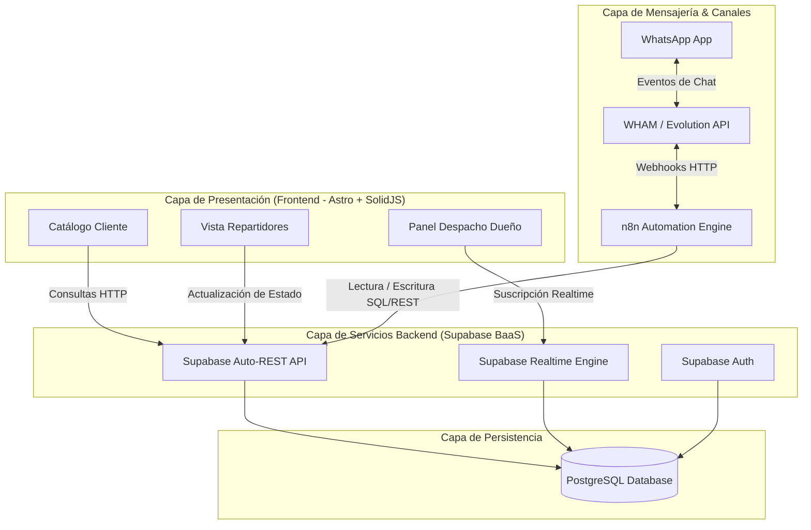

<div align="center">
  
  
  # Center Gás Curitiba
  **Plataforma de Transformación Digital & Logística de Última Milla**
  
  [](https://github.com/arcavcwb/center-gas)
  [](#)
  [](docs/15-agentic-flow-manual.md)
  [](#)
</div>

---

## 🚀 La Visión
Center Gás Curitiba es una empresa local de entrega de gas (P13) y agua (20L). Esta plataforma tiene como misión **transformar una operación manual vía WhatsApp** en un ecosistema digital automatizado, reduciendo el ingreso manual de datos, mejorando la experiencia del cliente y brindando telemetría en tiempo real al propietario y repartidores.

---

## 🤖 El Squad Agéntico (Zero-Trust)
Este repositorio no es un proyecto de software tradicional. Es gobernado y desarrollado por un **Squad de 10 Agentes de IA autónomos** orquestados bajo una filosofía estricta de **Cero Confianza (Zero-Trust)**.

### El Triángulo de Gobernanza
- 📋 **Plane (Fuente de Verdad):** Donde vive el negocio, los requerimientos (Issue) y la bitácora de los agentes.
- 🔀 **Git/GitHub (Juez Incorruptible):** Donde el código es auditado automáticamente antes de llegar a Producción.
- 👤 **El Humano (Autoridad Final):** Quien define reglas, abre las puertas (Gates) y toma decisiones estratégicas.

### Nuestros 10 Agentes
| Especialidad | Agente (ID) | Modelo Asignado |
|---|---|---|
| 🏛️ **Arquitectura** | `@architect-agent` | 👑 `claude-3-opus` |
| 🛡️ **Seguridad / Review** | `@pr-reviewer-agent` | ⚡ `gemini-3.6-flash` |
| 🧪 **QA & Testing** | `@qa-agent` | 🟠 `claude-3.5-sonnet` |
| 💻 **Frontend Dev** | `@frontend-dev-agent` | 🧠 `gemini-3.1-pro` |
| 💾 **Backend & DB** | `@backend-dev-agent` | 🧠 `gemini-3.1-pro` |
| 🎨 **UI/UX Design** | `@designer-agent` | ⚡ `gemini-3.6-flash` |
| 📈 **Product Owner** | `@po-agent` | ⚡ `gemini-3.6-flash` |
| ⏱️ **Scrum Master** | `@scrum-master-agent` | ⚡ `gemini-3.6-flash` |
| ⚙️ **DevOps & CI/CD** | `@devops-agent` | 🧠 `gemini-3.1-pro` |
| 🤖 **Automatización** | `@automation-agent` | 🧠 `gemini-3.1-pro` |

> 📖 **Lectura Recomendada:** Conoce los detalles de esta orquestación en el [Manual de Flujo Agéntico (docs/15)](docs/15-agentic-flow-manual.md).

---

## 🏗️ Arquitectura Técnica (Stack)
- **Frontend App (Cliente):** `Astro` + `SolidJS` (Enfocado en velocidad extrema y bajo JS).
- **Frontend Dashboard (Admin/Repartidor):** `Next.js 15` (App Router) + `TailwindCSS` (Shadcn/UI).
- **Backend & Autenticación:** `Supabase` (PostgreSQL, RLS, Edge Functions, Realtime).
- **Automatizaciones (WhatsApp/CRM):** `n8n` (Workflows).



---

## 📁 Estructura del Repositorio
```text
center-gas-platform/
├── .agents/                 # 🤖 Configuración del Squad (agy CLI) y Skills
├── .github/                 # ⚙️ CI/CD Workflows (Zero-Trust pipelines)
├── apps/                    # 💻 Código Frontend (Next.js, Astro) [Próximamente]
├── packages/                # 📦 Contratos Zod compartidos [Próximamente]
├── supabase/                # 🗄️ Migraciones SQL y RLS [Próximamente]
├── docs/                    # 📚 Documentación estructurada (00 a 15)
└── plane/                   # 📋 Espejos de la estructura de Plane
```

---

## 🗺️ Mapa de Documentación
El trabajo de consultoría y planificación ya está completado y documentado exhaustivamente. Ningún agente asume información; todo proviene de aquí:

| Doc | Descripción | Estado |
|---|---|---|
| `docs/00` a `docs/05` | Análisis de Negocio (AS-IS, TO-BE, Reglas) | ✅ Auditado |
| `docs/06-prd.md` | Product Requirements Document | ✅ Validado |
| `docs/08-technical-architecture.md` | Decisiones Técnicas (Stack) | ✅ Validado |
| `docs/09-database-design.md` | Esquema relacional Supabase | ✅ Auditado |
| `docs/15-agentic-flow-manual.md` | Protocolo de Handoffs de Agentes | 👑 **Core** |

---

<div align="center">
  <p>Construido por <strong>arcavcwb</strong> y el <strong>Antigravity Squad</strong> bajo un enfoque <br/><i>"Plane for the Business, Git for the Code"</i></p>
</div>
