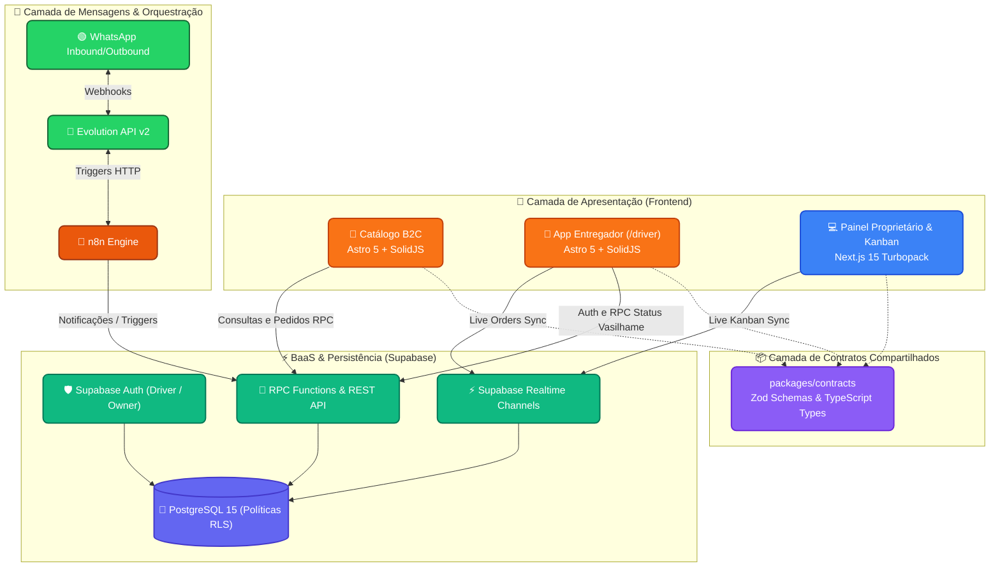

<div align="center">
  <a href="README.md">Español</a> | 🇧🇷 <b>Português do Brasil</b> | <a href="README.en.md">English</a>
</div>

---

<div align="center">
  
  
  # Center Gás Curitiba
  **Plataforma de Transformação Digital & Logística de Última Milha**
  
  [](https://center-gas-site.vercel.app)
  [](https://vercel.com)
  [](#-arquitetura-técnica-stack)
  [](#-design-e-experiência-sistema-impeccable)
  [](docs/15-agentic-flow-manual.md)
</div>

---

## 🌐 Links em Produção (Vercel)

| Aplicação | Público-Alvo | Stack | URL de Produção |
|---|---|---|---|
| 🛒 **Catálogo de Clientes (B2C)** | Clientes finais no Pinheirinho | Astro 5 + SolidJS | [https://center-gas-site.vercel.app](https://center-gas-site.vercel.app) |
| 🛵 **App do Entregador (Mobile)** | Motoboys em rota (Outdoor) | Astro 5 + SolidJS | [https://center-gas-site.vercel.app/driver](https://center-gas-site.vercel.app/driver) |
| 💻 **Painel de Despacho & Kanban (B2B)** | Proprietário e Operações | Next.js 15 (Turbopack) | [https://center-gas-web.vercel.app](https://center-gas-web.vercel.app) |

---

## 🚀 A Visão e Proposta de Negócio
A Center Gás Curitiba é a distribuidora de referência no bairro Pinheirinho (Curitiba - PR) para o fornecimento residencial de gás de cozinha (GLP P13) e água mineral (galões de 20L).

Esta plataforma substitui a captura manual e desorganizada de pedidos via WhatsApp por um ecossistema digital moderno, ágil e de alta disponibilidade:
- **Zero atrito:** Catálogo móvel que abre instantaneamente no navegador sem downloads de lojas de aplicativos.
- **Combos inteligentes:** Desconto automático de R$ 5,00 ao combinar gás com água mineral.
- **Disponibilidade 24/7 com agendamento:** Janela de entregas comercial das 08:00 às 20:00; pedidos noturnos e aos domingos são agendados com total transparência para o próximo dia útil a partir das 08:30.
- **Bilíngue nativo:** Alternância instantânea entre Português do Brasil (`pt-BR`) e Espanhol (`es`).
- **Controle rigoroso de vasilhames (Regra BR-002):** Diferenciação clara entre troca regular de refil (devolução do casco vazio) e compra de botijão novo (+ R$ 200,00 de vasilhame).
- **Cálculo de troco automático:** O cliente informa com quanto vai pagar e o sistema calcula o troco exato a levar pelo entregador.

---

## 🤖 O Squad Agêntico (Zero-Trust)
Este repositório é governado e desenvolvido por um **Squad de 10 Agentes de IA autônomos** operando sob uma filosofia rígida de **Confiança Zero (Zero-Trust)**:
- 📋 **Plane (Única Fonte da Verdade):** Onde são geridos os requisitos de negócio, épicos, issues e a máquina de estados.
- 🔀 **Git/GitHub (Juiz Incorruptível):** Nenhum commit direto na branch `main`. Toda alteração flui por feature branches (`feat/ISSUE-XXX`), Pull Requests auditados e squash merges.
- 👤 **O Humano (Autoridade Final):** Quem valida as decisões arquiteturais em `implementation_plan.md` e autoriza as promoções para produção.

### Nosso Squad de Agentes
| Especialidade | Agente (ID) | Modelo Atribuído |
|---|---|---|
| 🏛️ **Arquitetura** | `@architect-agent` | 👑 `claude-opus-4-6-thinking` |
| 🛡️ **Segurança / Review** | `@pr-reviewer-agent` | 🔬 `gemini-3.1-pro-high` |
| 🧪 **QA & Testing** | `@qa-agent` | 🔬 `gemini-3.1-pro-high` |
| 💻 **Frontend Dev** | `@frontend-dev-agent` | 🟠 `claude-sonnet-4-6` |
| 💾 **Backend & DB** | `@backend-dev-agent` | 🟠 `claude-sonnet-4-6` |
| 🎨 **UI/UX Design** | `@designer-agent` | ⚡ `gemini-3.8-flash-high` |
| 📈 **Product Owner** | `@po-agent` | ⚡ `gemini-3.8-flash-high` |
| ⏱️ **Scrum Master** | `@scrum-master-agent` | ⚡ `gemini-3.8-flash-high` |
| ⚙️ **DevOps & CI/CD** | `@devops-agent` | 🟠 `claude-sonnet-4-6` |
| 🤖 **Automação** | `@automation-agent` | ⚡ `gemini-3.8-flash-high` |

---

## 🏗️ Arquitetura Técnica (Stack)

- **Monorepo:** Gerenciado com `pnpm workspaces` e orquestrado via `Turborepo`.
- **Frontend Catálogo & Motoboy (`apps/site`):** `Astro 5` + ilhas reativas em `SolidJS` para peso JavaScript próximo a zero e máxima velocidade de carregamento mobile.
- **Frontend Dashboard B2B (`apps/web`):** `Next.js 15` (App Router com Turbopack), `React`, `TailwindCSS` e assinaturas persistentes `Supabase Realtime`.
- **Contratos Compartilhados (`packages/contracts`):** Única fonte de verdade com esquemas `Zod` e tipagem TypeScript inferida para validação de dados em toda a plataforma.
- **Backend & BaaS (`supabase/`):** `Supabase PostgreSQL` com Row Level Security (RLS), funções RPC transacionais e WebSockets em tempo real.
- **Automações WhatsApp:** `n8n` integrado com `Evolution API v2` com protocolos de mitigação de banimento.



---

## 🎨 Design e Experiência: Sistema Impeccable

Toda a interface do sistema foi desenhada e auditada sob o padrão **Impeccable Design System**:
- **0 Anti-patterns:** 100% de conformidade de contraste (`WCAG AA`), tipografia proporcional e eliminação de vícios visuais de IA (`border-l-4`, `gray-on-color`).
- **Iconografia SVG Pura:** Zero emojis em elementos de ação; todos os botões e estados utilizam ícones SVG geométricos e consistentes.
- **Ergonomia Tátil Mobile:** Botões de ação com altura de **no mínimo 48px** no app do entregador e no catálogo mobile.
- **Paleta de Identidade Oficial:**
  - Laranja Corporativo: `#F6842F`
  - Laranja Acessível WCAG AA: `#EA580C`
  - Azul Corporativo: `#046BD2`
  - Neutros: Escala `slate-*` com alto contraste sob a luz solar.

---

## 📁 Estrutura do Repositório

```text
center-gas-platform/
├── .agents/                 # 🤖 Configuração do Squad e Skills do Antigravity
├── .github/                 # ⚙️ CI/CD Workflows (GitHub Actions)
├── apps/
│   ├── site/                # 🛒 Catálogo Mobile B2C & App do Entregador (/driver) em Astro + SolidJS
│   ├── web/                 # 💻 Painel B2B Kanban, Admin e Métricas em Next.js 15 Turbopack
│   └── e2e/                 # 🧪 Suite de testes End-to-End com Playwright
├── packages/
│   ├── contracts/           # 📦 Contratos Zod e tipagem TypeScript compartilhada
│   └── ui-tokens/           # 🎨 Tokens visuais do design Impeccable
├── supabase/                # 🗄️ Migrações SQL, esquemas DDL e políticas RLS
├── docs/                    # 📚 Documentação formal do projeto
│   └── walkthroughs/        # 📝 Relatórios técnicos detalhados de cada Issue e PR
├── workflows/               # 🤖 Definições JSON de automações para n8n
└── turbo.json               # ⚡ Configuração do Turborepo
```

---

## 🧪 Testes e Qualidade de Software

```bash
# Instalar dependências com pnpm
pnpm install

# Executar testes unitários de contratos
pnpm run test:unit

# Compilar todo o monorepo
pnpm build

# Auditoria estática de padrões UI Impeccable
./.agent/skills/impeccable/scripts/impeccable detect apps/site/src apps/web/src
```

---

## 🗺️ Mapa de Documentação

| Documento | Descrição | Status |
|---|---|---|
| [`docs/00` a `05`](docs/) | Análise de Negócio (AS-IS, TO-BE, Regras BR) | ✅ Auditado |
| [`docs/06-prd.md`](docs/06-prd.md) | Product Requirements Document | ✅ Concluído |
| [`docs/07-ui-ux.md`](docs/07-ui-ux.md) | Sistema de Design e Interface Impeccable | ✅ Atualizado |
| [`docs/08-technical-architecture.md`](docs/08-technical-architecture.md) | Arquitetura de Software e Topologia Monorepo | ✅ Atualizado |
| [`docs/09-database-design.md`](docs/09-database-design.md) | Esquema relacional PostgreSQL, DDL e RLS | ✅ Auditado |
| [`docs/11-roadmap.md`](docs/11-roadmap.md) | Roadmap de Épicos e Entregas | ✅ Épicos 1-5 Concluídos |
| [`docs/13-ai-context-summary.md`](docs/13-ai-context-summary.md) | Resumo de Contexto de IA para o Squad | ✅ Sincronizado |
| [`docs/15-agentic-flow-manual.md`](docs/15-agentic-flow-manual.md) | Protocolo de Handoffs e Governança Agêntica | 👑 **Core** |
| [`docs/VERCEL_DEPLOYMENT_GUIDE.md`](docs/VERCEL_DEPLOYMENT_GUIDE.md) | Guia de Deploy Duplo na Vercel | ✅ Validado |
| [`docs/walkthroughs/`](docs/walkthroughs/) | Relatórios técnicos exhaustivos de PRs | 📑 29 Relatórios |

---

<div align="center">
  <p>Construído por <strong>arcavcwb</strong> e o <strong>Antigravity Squad</strong> sob a filosofia <br/><i>"Plane for the Business, Git for the Code"</i></p>
</div>
