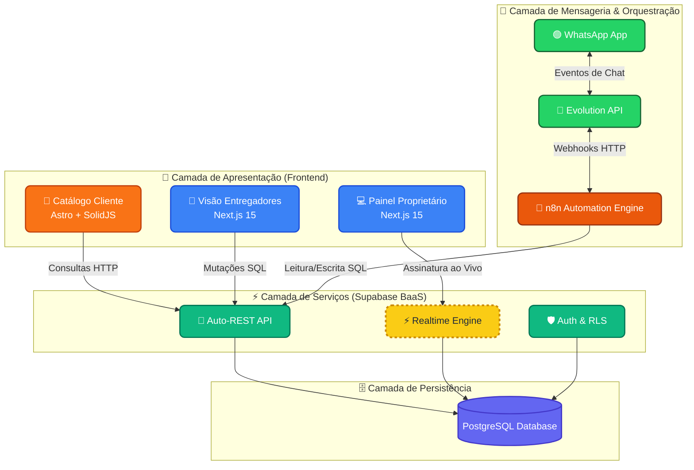

<div align="center">
  🌎 <a href="README.md">Español</a> | <b>Português do Brasil</b> | <a href="README.en.md">English</a>
</div>

---

<div align="center">
  
  
  # Center Gás Curitiba
  **Plataforma de Transformação Digital & Logística de Última Milha**
  
  [](https://github.com/arcavcwb/center-gas)
  [](#)
  [](docs/15-agentic-flow-manual.md)
  [](#)
</div>

---

## 🚀 A Visão
A Center Gás Curitiba é uma empresa local de entrega de gás (P13) e água (20L). A missão desta plataforma é **transformar uma operação manual via WhatsApp** em um ecossistema digital automatizado, reduzindo a entrada manual de dados, melhorando a experiência do cliente e fornecendo telemetria em tempo real para o proprietário e entregadores.

---

## 🤖 O Esquadrão Agêntico (Zero-Trust)
Este repositório não é um projeto de software tradicional. Ele é governado e desenvolvido por um **Esquadrão de 10 Agentes de IA autônomos** orquestrados sob uma rigorosa filosofia de **Confiança Zero (Zero-Trust)**.

### O Triângulo de Governança
- 📋 **Plane (Fonte da Verdade):** Onde o negócio vive, os requisitos (Issues) e o log dos agentes.
- 🔀 **Git/GitHub (Juiz Incorruptível):** Onde o código é auditado automaticamente antes de chegar à Produção.
- 👤 **O Humano (Autoridade Final):** Quem define as regras, abre as portas (Gates) e toma decisões estratégicas.

### Nossos 10 Agentes
| Especialidade | Agente (ID) | Modelo Atribuído |
|---|---|---|
| 🏛️ **Arquitetura** | `@architect-agent` | 👑 `claude-3-opus` |
| 🛡️ **Segurança / Review** | `@pr-reviewer-agent` | ⚡ `gemini-3.6-flash` |
| 🧪 **QA & Testing** | `@qa-agent` | 🟠 `claude-3.5-sonnet` |
| 💻 **Frontend Dev** | `@frontend-dev-agent` | 🟠 `claude-3.5-sonnet` |
| 💾 **Backend & DB** | `@backend-dev-agent` | 🟠 `claude-3.5-sonnet` |
| 🎨 **UI/UX Design** | `@designer-agent` | 🟠 `claude-3.5-sonnet` |
| 📈 **Product Owner** | `@po-agent` | 🟠 `claude-3.5-sonnet` |
| ⏱️ **Scrum Master** | `@scrum-master-agent` | 🟠 `claude-3.5-sonnet` |
| ⚙️ **DevOps & CI/CD** | `@devops-agent` | 🟠 `claude-3.5-sonnet` |
| 🤖 **Automação** | `@automation-agent` | 🟠 `claude-3.5-sonnet` |

> 📖 **Leitura Recomendada:** Conheça os detalhes dessa orquestração no [Manual de Fluxo Agêntico (docs/15)](docs/15-agentic-flow-manual.md).

---

## 🏗️ Arquitetura Técnica (Stack)
- **Frontend App (Cliente):** `Astro` + `SolidJS` (Focado em extrema velocidade e baixo JS).
- **Frontend Dashboard (Admin/Entregador):** `Next.js 15` (App Router) + `TailwindCSS` (Shadcn/UI).
- **Backend & Autenticação:** `Supabase` (PostgreSQL, RLS, Edge Functions, Realtime).
- **Automações (WhatsApp/CRM):** `n8n` (Workflows).



---

## 📁 Estrutura do Repositório
```text
center-gas-platform/
├── .agents/                 # 🤖 Configuração do Esquadrão (agy CLI) & Skills
├── .github/                 # ⚙️ Workflows CI/CD (Pipelines Zero-Trust)
├── apps/                    # 💻 Código Frontend (Next.js, Astro) [Em breve]
├── packages/                # 📦 Contratos Zod compartilhados [Em breve]
├── supabase/                # 🗄️ Migrações SQL e RLS [Em breve]
├── docs/                    # 📚 Documentação estruturada (00 a 15)
└── plane/                   # 📋 Espelhos da estrutura do Plane
```

---

## 🗺️ Mapa de Documentação
O trabalho de consultoria e planejamento já está concluído e exaustivamente documentado. Nenhum agente assume informações; tudo vem daqui:

| Doc | Descrição | Status |
|---|---|---|
| `docs/00` a `docs/05` | Análise de Negócios (AS-IS, TO-BE, Regras) | ✅ Auditado |
| `docs/06-prd.md` | Documento de Requisitos do Produto (PRD) | ✅ Validado |
| `docs/08-technical-architecture.md` | Decisões Técnicas (Stack) | ✅ Validado |
| `docs/09-database-design.md` | Esquema relacional Supabase | ✅ Auditado |
| `docs/15-agentic-flow-manual.md` | Protocolo de Handoffs de Agentes | 👑 **Core** |

---

<div align="center">
  <p>Construído por <strong>arcavcwb</strong> e o <strong>Esquadrão Antigravity</strong> sob uma <br/>abordagem <i>"Plane for the Business, Git for the Code"</i></p>
</div>
