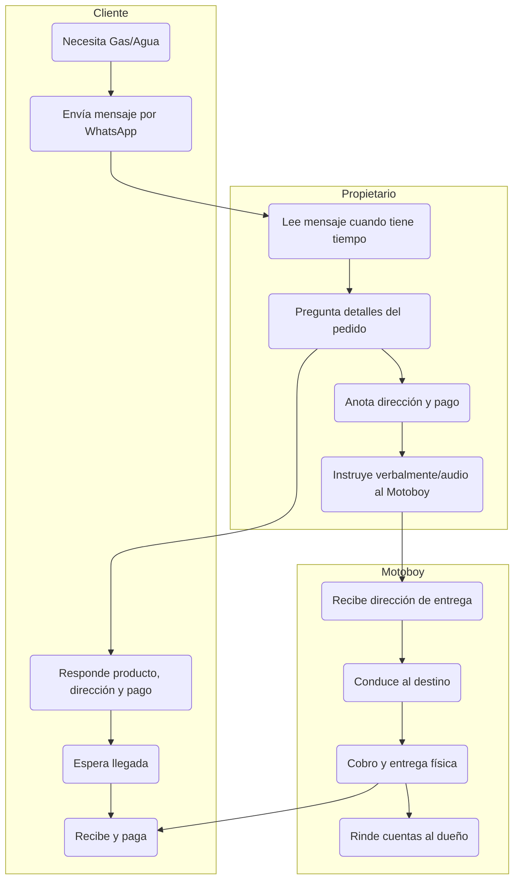
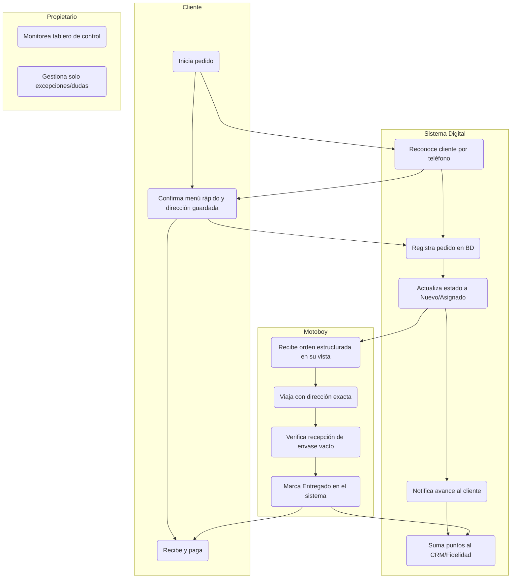
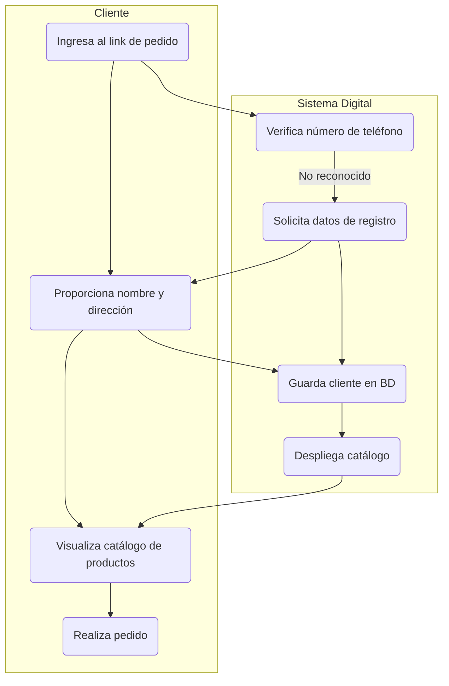
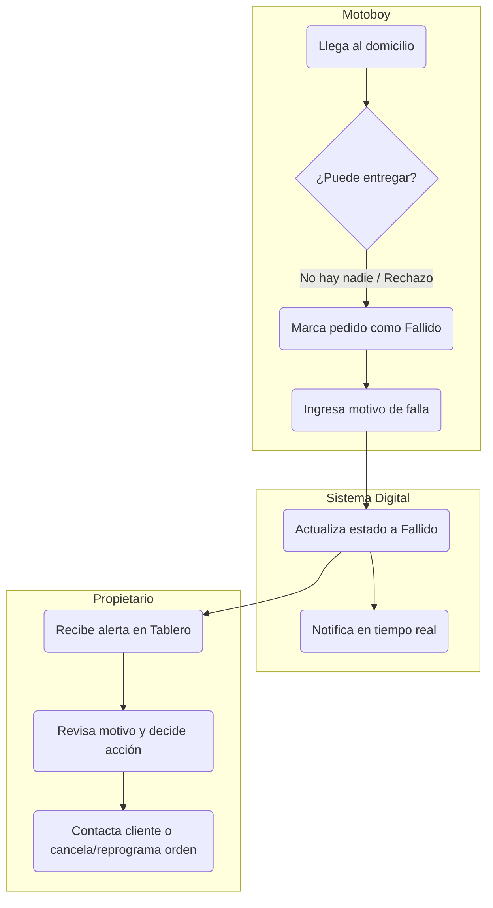

# 03 - Procesos de Negocio (Business Processes)

## Propósito
El propósito de este documento es definir detalladamente los flujos de procesos operativos y de cara al cliente de Center Gás Curitiba, comparando el estado actual manual (**AS-IS**) con el estado futuro digitalizado (**TO-BE**). Sirve para visibilizar exactamente cómo debe transformarse la operación sin introducir propuestas tecnológicas aún.

## Alcance
**Dentro del Alcance:**
- Mapeo del Customer Journey (AS-IS vs TO-BE).
- Flujo de Gestión de Pedidos (Order Flow).
- Flujo Logístico de Entrega (Delivery Flow).
- Flujo de Información (Information Flow).
- Modelado gráfico BPMN/Swimlanes mediante diagramas Mermaid.

**Fuera del Alcance:**
- Selección de stack tecnológico o lenguajes de programación (se tratarán en `08-technical-architecture.md`).
- Esquemas de bases de datos relacionales (se tratarán en `09-database-design.md`).

## Contexto
Los documentos previos (`01-business-discovery.md` y `02-current-state-analysis.md`) identificaron la alta dependencia operativa en el propietario y la pérdida de datos como los dolores principales. Este documento diseña los procesos futuros (TO-BE) diseñados para eliminar la fricción repetitiva y escalar la capacidad de atención del negocio.

---

## Contenido Principal

### 1. Customer Journey (Viaje del Cliente)

#### AS-IS (Actual)
1. **Necesidad:** El cliente detecta que se quedó sin gas o agua.
2. **Contacto:** Busca el contacto de WhatsApp y escribe un mensaje no estructurado.
3. **Espera:** Espera a que el dueño se desocupe y responda.
4. **Fricción Repetitiva:** Responde preguntas sobre producto deseado, dirección completa y método de pago (aunque ya haya comprado antes).
5. **Recepción & Pago:** Espera al repartidor, paga en efectivo/tarjeta/PIX y recibe el producto.
6. **Cierre:** La transacción finaliza sin registro centralizado ni seguimiento post-venta.

#### TO-BE (Futuro)
1. **Necesidad / Disparador:** El cliente nota falta de producto o recibe una notificación preventiva de reorden.
2. **Acceso Ágil:** Abre el canal de auto-atención (catálogo/bot).
3. **Selección en 2 Clics:** El sistema reconoce su número de teléfono, muestra su dirección habitual guardada y le permite confirmar su pedido en segundos.
4. **Despacho Transparente:** El cliente recibe la confirmación inmediata de que su pedido fue asignado y va en camino.
5. **Recepción & Pago:** El motoboy llega con la información exacta, efectúa el cobro y entrega.
6. **Fidelización:** El sistema acredita automáticamente la compra al programa de lealtad (8->1) y actualiza el historial.

---

### 2. BPMN / Swimlane Diagrams

#### Diagrama BPMN: Estado Actual (AS-IS)


#### Diagrama BPMN: Estado Futuro (TO-BE)


---

### 3. Flujo de Pedidos (Order Flow)

* **AS-IS:** Mensaje libre -> Preguntas del dueño -> Confirmación manual -> Anotación informal.
* **TO-BE:** Selección de producto -> Confirmación de datos pre-cargados -> Asignación de ID de Pedido (`Nuevo` -> `En Camino` -> `Entregado`) -> Registro en Base de Datos.

---

### 4. Flujo de Entrega (Delivery Flow)

* **AS-IS:** El dueño transmite la dirección por voz/texto libre al motoboy -> El motoboy busca la ubicación -> Entrega -> Rendición de dinero al final del turno.
* **TO-BE:** El sistema asigna el pedido al motoboy -> El motoboy visualiza la orden en su dispositivo con enlace directo a mapas -> Al entregar, verifica recepción del envase vacío y marca el pedido como `Entregado` -> El inventario y caja se actualizan al instante.

---

### 5. Flujo de Información (Information Flow)

```mermaid
graph LR
    subgraph AS-IS (Información Fragmentada)
        Cli1(Cliente) -->|Chat Manual| Due1(Dueño)
        Due1 -->|Audio/Texto| Mot1(Motoboy)
        Due1 -->|Sin registro| Perd(Pérdida de Datos)
    end
```

```mermaid
graph LR
    subgraph TO-BE (Información Centralizada)
        Cli2(Cliente) <-->|Auto-servicio| BD[(Sistema Central / CRM)]
        BD <-->|Tablero de Control| Due2(Dueño)
        BD <-->|Orden Específica| Mot2(Motoboy)
    end
```

---

### 6. Flujo de Cliente Nuevo (Primera Compra)

Este flujo (FR1.5) describe el proceso cuando un cliente interactúa con el sistema por primera vez y su número de teléfono no está registrado.



---

### 7. Flujo de Entrega Fallida

Este flujo (BR-010) describe el escenario de excepción donde el repartidor no puede concretar la entrega y se requiere intervención del propietario.



---

## Preguntas Abiertas
- En el flujo TO-BE, ¿se permitirá que el cliente agregue notas especiales (ej. "tocar el timbre de la izquierda") al confirmar su dirección guardada?
- ¿Cómo se procederá en el flujo de entrega cuando el motoboy no encuentre a nadie en el domicilio? ¿Quién cambia el estado del pedido a "Fallido"?

## Dependencias
- Aprobación de los flujos TO-BE por parte del cliente para asegurar que se ajustan a la realidad del equipo de repartidores.
- Mapeo de reglas específicas en el siguiente documento (`04-business-rules.md`).

## Referencias
- [00-project-charter.md](00-project-charter.md)
- [01-business-discovery.md](01-business-discovery.md)
- [02-current-state-analysis.md](02-current-state-analysis.md)

## Historial de Revisiones
| Versión | Fecha | Autor | Descripción |
|---------|-------|-------|-------------|
| 1.0 | 2026-07-22 | Lead Product Manager | Borrador inicial de Procesos de Negocio (AS-IS vs TO-BE) |

## Próximos Pasos
1. Validar los diagramas de flujo y Swimlanes con las partes interesadas.
2. Iniciar la Fase 5: **Reglas de Negocio** (`04-business-rules.md`) para detallar las políticas de intercambio, cobro, zonas y comisiones.
