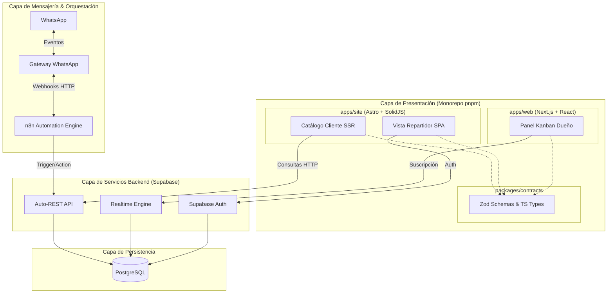

# 08 - Arquitectura Técnica (Technical Architecture)

## Propósito
Definir la arquitectura de software, la topología del monorepo, la selección del stack tecnológico híbrido, los patrones de integración y la infraestructura requerida para la plataforma digital de Center Gás Curitiba. Prioriza la máxima simplicidad, alta disponibilidad, rendimiento veloz y costo de mantenimiento cercano a cero.

## Alcance
**Dentro del Alcance:**
- Topología del Monorepo (pnpm workspaces / Turborepo).
- Selección y justificación técnica del stack híbrido (Astro, SolidJS, Next.js, React).
- Diagramas de arquitectura del sistema y flujos de datos en Mermaid.
- Consideraciones de seguridad y protección de datos (LGPD).

**Fuera del Alcance:**
- Modelado detallado de tablas SQL y scripts DDL (ver `09-database-design.md`).

---

## 1. Topología del Monorepo y Stack Híbrido

Para garantizar la separación de preocupaciones y optimizar el rendimiento según el usuario final, el proyecto adopta una arquitectura de **Monorepo** (pnpm workspaces / turborepo) dividida en dos aplicaciones principales y paquetes compartidos.

### Control de Versiones (Trunk-Based Development)
El proyecto utiliza un modelo Trunk-Based Development con `main` protegida. Los agentes desarrollan en ramas aisladas (`feat/`) y son auditados estáticamente por el `pr-reviewer-agent` y dinámicamente por el `qa-agent` antes de realizar merge.

### Aplicaciones (Apps)

| Aplicación | Dominio | Stack Tecnológico | Justificación |
|---|---|---|---|
| **`apps/site`** | Catálogo Cliente & Vista Repartidor (LP) | **Astro + SolidJS** | Astro genera SSR ultrarrápido sin JS innecesario, vital para la rapidez en móviles. La parte dinámica se maneja con islas en SolidJS utilizando Shadow DOM, evitando conflictos de renderizado en navegadores (como Safari en iPhone). Esto es crítico porque la LP funcionará como portal masivo de pedidos móviles. |
| **`apps/web`** | Panel Kanban (Dueño/Operaciones) | **Next.js + React** | El panel requiere manejo de estado complejo en cliente, conexiones Websocket abiertas prolongadas y múltiples mutaciones simultáneas. Next.js ofrece el ecosistema más robusto para dashboards SPA-like. |

### Paquetes Compartidos (Packages)

| Paquete | Propósito |
|---|---|
| **`packages/contracts`** | Contratos Zod para validación cruzada y tipos TypeScript inferidos. Única fuente de verdad de la "forma" de los datos entre DB, apps/site, apps/web y las funciones Edge. |
| **`packages/ui-tokens`** | Tokens de diseño (colores, espaciados, tipografía) de Impeccable compartidos entre React (apps/web) y SolidJS (apps/site) vía CSS custom properties. |

---

## 2. Componentes de Infraestructura y Backend

| Componente | Tecnología | Justificación Técnica |
|---|---|---|
| **Backend as a Service** | **Supabase** | Elimina la necesidad de programar un backend Node.js tradicional. Proporciona Auth, API REST autogenerada y Realtime API para el Kanban. |
| **Base de Datos** | **PostgreSQL** | Motor relacional robusto. Garantiza integridad transaccional (ACID) y seguridad perimetral vía RLS. |
| **Orquestador Lógico** | **n8n** | Maneja la lógica asíncrona, webhooks de WhatsApp y triggers de base de datos sin acoplar el frontend a flujos pesados. |
| **Gateway WhatsApp** | **Por definir (ISSUE-403)** | Meta Cloud API vs Evolution API. Manejará la mensajería inbound/outbound. |
| **APIs Externas** | **ViaCEP** | API pública brasileña para autocompletado instantáneo de direcciones mediante el Código Postal (CEP). Reduce fricción en el frontend. |
| **Telemetría y Logs** | **Sentry + OpenPanel** | Sentry captura errores de Javascript/UI en tiempo real. OpenPanel ofrece analítica self-hosted y LGPD-compliant para métricas de negocio. |
| **Monitorización** | **Uptime Kuma** | Watchdog self-hosted para verificar el uptime de N8N, Supabase y los frontends cada 60s, con alertas a Telegram/WhatsApp. |

---

## 3. Diagrama de Arquitectura Integrada

---

## 4. Seguridad y Cumplimiento LGPD

1. **Autorización Perimetral (RLS):** Toda la lógica de autorización reside en PostgreSQL vía Row Level Security. `apps/web` y `apps/site` interactúan con la BD asumiendo su identidad (`auth.uid()`), delegando la restricción de filas al motor SQL.
2. **Links Efímeros (ISSUE-106):** Eliminación de parámetros predictivos (`?tel=...`). El catálogo se carga mediante tokens criptográficos opacos generados en n8n que expiran en 24-48h, asegurando el cumplimiento de la LGPD (Ley General de Protección de Datos).
3. **Validación Exhaustiva:** El paquete `packages/contracts` previene inyecciones asegurando que cada payload que viaja desde el cliente a Supabase o n8n cumpla con su esquema estricto.

---

## Historial de Revisiones
| Versión | Fecha | Autor | Descripción |
|---------|-------|-------|-------------|
| 1.0 | 2026-07-23 | Tech Arch | Definición inicial |
| 2.0 | 2026-07-26 | Antigravity | Refactor: Inclusión formal de Monorepo híbrido (Next.js / Astro) acorde a ISSUE-101 e ISSUE-201. |
| 2.1 | 2026-07-26 | Antigravity | Add: Capa de Telemetría (Sentry, Uptime Kuma, OpenPanel) y dependencias de API externa (ViaCEP). |
