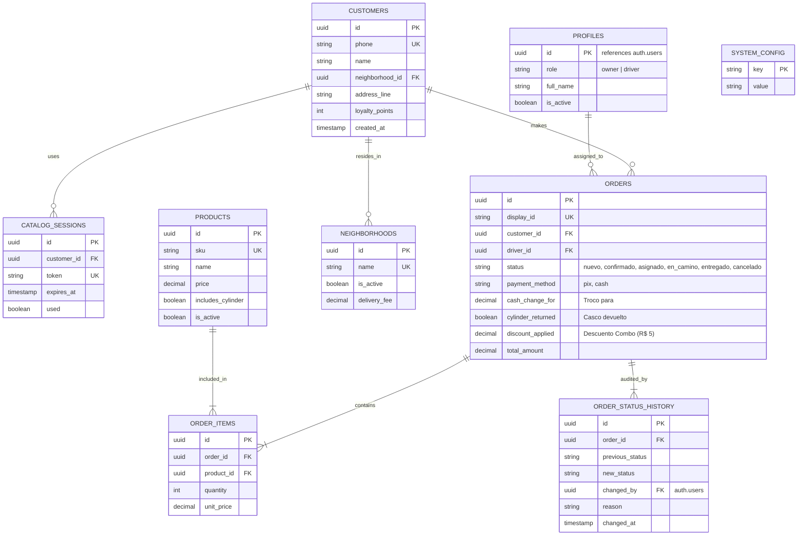

# 09 - Diseño de Base de Datos (Database Design)

## Propósito
Detallar el modelo relacional de datos en PostgreSQL (Supabase). Define las entidades, relaciones, historial de auditoría y políticas de seguridad RLS (Row Level Security) necesarias para cumplir con los 26 requerimientos funcionales documentados en Plane.

## Contexto
Este modelo cubre todos los hallazgos de Plane (ISSUE-102, 108): Soporte para "Troco", control de envases vacíos (Cascos), links de sesión opacos y el historial inmutable de estados del pedido para la operación Kanban.

---

## 1. Diagrama Entidad-Relación (ERD)



---

## 2. Esquema Core DDL (PostgreSQL)

*(Nota: Este es el blueprint arquitectónico. Los scripts de migración formales irán en `supabase/migrations/`).*

```sql
CREATE EXTENSION IF NOT EXISTS "uuid-ossp";

-- Enumeraciones
CREATE TYPE order_status AS ENUM ('nuevo', 'confirmado', 'asignado', 'en_camino', 'entregado', 'cancelado');
CREATE TYPE payment_method AS ENUM ('pix', 'cash');
CREATE TYPE user_role AS ENUM ('owner', 'driver');

-- 1. Profiles (Identidad extendida de Supabase Auth)
CREATE TABLE profiles (
    id UUID PRIMARY KEY REFERENCES auth.users(id) ON DELETE CASCADE,
    role user_role NOT NULL,
    full_name VARCHAR(100) NOT NULL,
    is_active BOOLEAN DEFAULT true
);

-- 2. Neighborhoods (Barrios - Cobertura)
CREATE TABLE neighborhoods (
    id UUID PRIMARY KEY DEFAULT uuid_generate_v4(),
    name VARCHAR(100) UNIQUE NOT NULL,
    is_active BOOLEAN DEFAULT true,
    delivery_fee NUMERIC(10,2) DEFAULT 0.00
);

-- 3. Customers
CREATE TABLE customers (
    id UUID PRIMARY KEY DEFAULT uuid_generate_v4(),
    phone VARCHAR(20) UNIQUE NOT NULL,
    name VARCHAR(100), -- Nullable inicialmente
    neighborhood_id UUID REFERENCES neighborhoods(id),
    address_line VARCHAR(255),
    loyalty_points INT DEFAULT 0 CHECK (loyalty_points >= 0),
    created_at TIMESTAMP WITH TIME ZONE DEFAULT NOW()
);

-- 4. Catalog Sessions (ISSUE-106 LGPD)
CREATE TABLE catalog_sessions (
    id UUID PRIMARY KEY DEFAULT uuid_generate_v4(),
    token VARCHAR(64) UNIQUE NOT NULL,
    customer_id UUID REFERENCES customers(id), -- Nullable si es primera compra
    phone_context VARCHAR(20), -- Teléfono de WhatsApp temporal
    expires_at TIMESTAMP WITH TIME ZONE NOT NULL,
    used_at TIMESTAMP WITH TIME ZONE
);

-- 5. Products (ISSUE-304: Distinción de cascos)
CREATE TABLE products (
    id UUID PRIMARY KEY DEFAULT uuid_generate_v4(),
    sku VARCHAR(20) UNIQUE NOT NULL,
    name VARCHAR(100) NOT NULL,
    price NUMERIC(10,2) NOT NULL CHECK (price >= 0),
    includes_cylinder BOOLEAN DEFAULT false,
    is_active BOOLEAN DEFAULT true
);

-- 6. Orders (ISSUE-303 Troco, ISSUE-105 Envases)
CREATE TABLE orders (
    id UUID PRIMARY KEY DEFAULT uuid_generate_v4(),
    display_id VARCHAR(10) UNIQUE NOT NULL,
    customer_id UUID NOT NULL REFERENCES customers(id),
    driver_id UUID REFERENCES profiles(id),
    status order_status DEFAULT 'nuevo',
    payment_method payment_method NOT NULL,
    cash_change_for NUMERIC(10,2), -- Cuánto entregará el cliente (para calcular troco)
    cylinder_returned BOOLEAN, -- Check del motoboy
    discount_applied NUMERIC(10,2) DEFAULT 0.00, -- Registro contable del descuento de combo (ISSUE-302)
    total_amount NUMERIC(10,2) NOT NULL CHECK (total_amount >= 0),
    created_at TIMESTAMP WITH TIME ZONE DEFAULT NOW()
);

-- 7. Order Items
CREATE TABLE order_items (
    id UUID PRIMARY KEY DEFAULT uuid_generate_v4(),
    order_id UUID NOT NULL REFERENCES orders(id) ON DELETE CASCADE,
    product_id UUID NOT NULL REFERENCES products(id),
    quantity INT NOT NULL CHECK (quantity > 0),
    unit_price NUMERIC(10,2) NOT NULL
);

-- 8. Order Status History (ISSUE-108, ISSUE-202 Auditoría y Cancelaciones)
CREATE TABLE order_status_history (
    id UUID PRIMARY KEY DEFAULT uuid_generate_v4(),
    order_id UUID NOT NULL REFERENCES orders(id) ON DELETE CASCADE,
    previous_status order_status,
    new_status order_status NOT NULL,
    changed_by UUID REFERENCES profiles(id),
    reason TEXT, -- Motivo de cancelación u observaciones
    changed_at TIMESTAMP WITH TIME ZONE DEFAULT NOW()
);

-- 9. System Config
CREATE TABLE system_config (
    key VARCHAR(50) PRIMARY KEY,
    value JSONB NOT NULL
);
```

---

## 3. Estrategia RLS (ISSUE-107)

El modelo asume que **toda petición frontend viaja con un JWT de Supabase**.
1. **Dueños (`role = 'owner'`):** Tienen `ALL` en casi todas las tablas operativas.
2. **Repartidores (`role = 'driver'`):**
   - Pueden hacer `SELECT` en `orders` **solo si** `driver_id = auth.uid()`.
   - Pueden hacer `UPDATE` en `orders` (solo campo `status` y `cylinder_returned`) **solo si** `driver_id = auth.uid()`.
   - No pueden borrar registros bajo ninguna circunstancia.
3. **Clientes (Sin Autenticación Supabase):**
   - Usan la función RPC `resolve_catalog_session(token)` ejecutada como `SECURITY DEFINER` (bypass RLS) para validar su token efímero y obtener sus datos para comprar. No se permite lectura pública de la tabla `customers`.

---

## Historial de Revisiones
| Versión | Fecha | Autor | Descripción |
|---------|-------|-------|-------------|
| 1.0 | 2026-07-23 | DB Architect | Borrador inicial |
| 2.0 | 2026-07-26 | Antigravity | Refactor total vs Plane: Agregada tabla de auditoría, soporte de troco, perfiles unificados y esquema en inglés estándar. |
