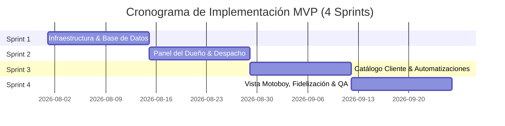

# 11 - Hoja de Ruta de Ejecución (Roadmap)

## Propósito
El propósito de este documento es definir el cronograma de ejecución incremental, la división de fases, los hitos clave (milestones) y la matriz de riesgos para la construcción y despliegue del MVP de Center Gás Curitiba.

## Alcance
**Dentro del Alcance:**
- Planificación temporal por sprints (4 Sprints de 2 semanas, total 8 semanas).
- Hitos de entrega validados con el dueño y el equipo logístico.
- Matriz de riesgos de implementación y planes de mitigación.

**Fuera del Alcance:**
- Planificación de fases posteriores al MVP (ej. expansión a múltiples sucursales o apps nativas en tiendas iOS/Android).

## Contexto
Toda la documentación conceptual, funcional, de UI/UX, arquitectura, base de datos e integraciones ha sido completada. Este documento establece cómo llevar estas especificaciones a la práctica de forma controlada y baja en riesgos.

---

## Contenido Principal

### 1. Cronograma de Ejecución Incremental (4 Sprints - 8 Semanas)

---

### 2. Detalle de Fases Entregables

#### Sprint 1: Infraestructura & Base de Datos (2026-08-01 a 2026-08-14)
* **Entregables (Issues 101-106):**
  * Configuración inicial del monorepo híbrido (Next.js para apps/web y Astro + SolidJS para apps/site) y tokens de diseño (#F6842F, #046BD2).
  * Aplicación del esquema DDL de PostgreSQL, índices y políticas RLS en Supabase.
  * Carga inicial de base de datos: catálogo de productos, barrios de cobertura y variables de configuración.
  * Implementación del link seguro de catálogo (sesión basada en token, en lugar de `?tel=`).
  * Flujo de registro de nuevos clientes para primeros compradores.
* **Criterio de Éxito:** Supabase autenticando peticiones y Frontend de Astro sirviendo el flujo básico de registro bajo enlaces seguros.

#### Sprint 2: Panel del Dueño & Despacho (2026-08-15 a 2026-08-28)
* **Entregables (Issues 201-202):**
  * Desarrollo del componente Tablero Kanban Realtime en Next.js + React.
  * Implementación de controles de asignación de motoboys.
  * Modal de cancelación de pedidos.
* **Criterio de Éxito:** El propietario puede ver aparecer los pedidos en tiempo real, moverlos y asignarlos o cancelarlos.

#### Sprint 3: Catálogo Cliente & Automatizaciones (2026-08-29 a 2026-09-11)
* **Entregables (Issues 301-302, 401-402):**
  * Catálogo web de auto-servicio con reconocimiento telefónico.
  * Validador de descuento automático de Combo Gas+Agua y validador de cobertura de barrio.
  * Configuración de instancia n8n y Workflow de auto-respuesta entrante de WhatsApp.
  * Workflow n8n para notificaciones automáticas de estado de pedido ("En camino").
* **Criterio de Éxito:** Un cliente manda WhatsApp, recibe auto-respuesta, hace el pedido en el catálogo con descuentos aplicados, y recibe notificación al ser despachado.

#### Sprint 4: Vista Motoboy, Fidelización & QA (2026-09-12 a 2026-09-25)
* **Entregables (Issues 501-502, 105):**
  * Interfaz móvil para repartidores con botón táctil gigante "Entregado" y enlace de mapa GPS.
  * Pantalla de validación de envase (casco/cilindro vacío).
  * Lógica de fidelización: incremento 8->1 y descuento del 100% en el 9º pedido de P13.
  * Pruebas QA completas y lanzamiento en producción.
* **Criterio de Éxito:** Operación completa desde el pedido en WhatsApp hasta la validación de entrega por el motoboy, sumando puntos de fidelidad correctamente.

---

### 3. Matriz de Riesgos y Mitigación

| Riesgo Identificado | Impacto | Probabilidad | Plan de Mitigación |
|---|---|---|---|
| **Resistencia al cambio de los repartidores** | Alto | Media | Interfaz ultra-simple (1 solo botón principal "Entregado"). Capacitación práctica directa en el local. |
| **Caída o bloqueo del número de WhatsApp** | Alto | Baja | Mantener fallback manual: el cliente aún puede ingresar directamente por la URL del catálogo web. |
| **Conexión móvil lenta de los repartidores** | Medio | Alta | La interfaz de repartidores es ligera (sin imágenes pesadas) y funciona mediante Astro estático. |

---

## Preguntas Abiertas
- ¿La prueba piloto de la Semana 5 se realizará en un día específico de menor tráfico (ej. un martes) para minimizar riesgos?
- ¿El propietario requiere sesiones de seguimiento semanales de 15 minutos durante la fase de estabilización?

## Dependencias
- Aprobación del roadmap para estructurar el plan final de **Despliegue** (`12-deployment.md`).

## Referencias
- [00-project-charter.md](00-project-charter.md)
- [06-prd.md](06-prd.md)
- [08-technical-architecture.md](08-technical-architecture.md)
- [09-database-design.md](09-database-design.md)
- [10-integrations.md](10-integrations.md)

## Historial de Revisiones
| Versión | Fecha | Autor | Descripción |
|---------|-------|-------|-------------|
| 1.0 | 2026-07-23 | Lead Product Manager | Planificación completa del Roadmap de 8 semanas y matriz de riesgos |

## Próximos Pasos
1. Revisar y aprobar el roadmap con el cliente.
2. Iniciar la Fase 13 (Fase Final de Documentación): **Despliegue** (`12-deployment.md`).
