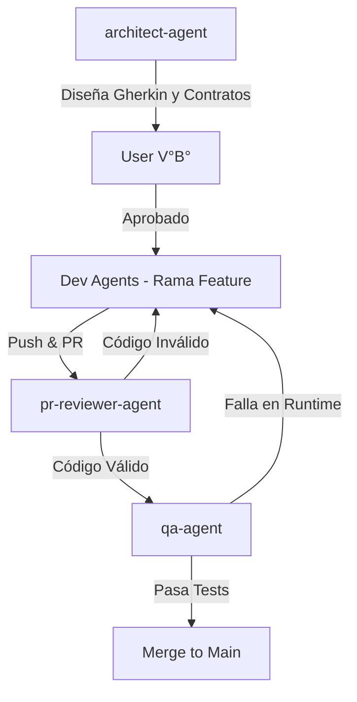
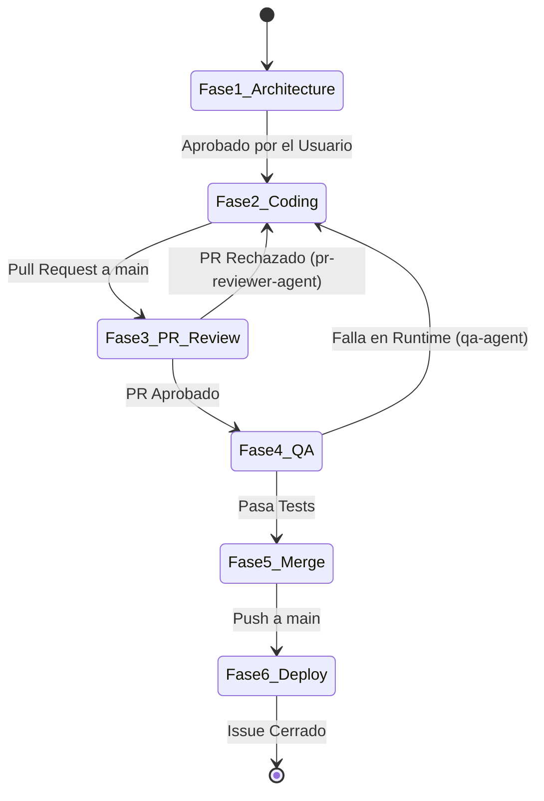

# 🤖 Agent Development Flow v2.0 (Flujo de Desarrollo Agéntico + BDD & Red-Team)

> **Proyecto:** Center Gás Curitiba  
> **Versión:** 2.0 (Enterprise Gherkin BDD & Black-Box Red-Team Edition)  
> **Propósito:** Establecer el protocolo estandarizado de desarrollo, pruebas basadas en comportamiento (BDD/Gherkin), pirámide de testing y auditoría contradictoria (Red-Team / Cero Confianza) entre el Usuario, el Agente Principal (Antigravity) y Subagentes Especializados.

---

## 1. Principios de Operación y Seguridad Cero Confianza

1. **Zero-Trust & Black-Box Auditing (Cero Confianza Externa):** El Agente Auditor no asumirá la intención ni la buena fe del código o DDL generado. Evaluará cada entrega como un atacante externo (hacker de caja negra) intentando romper, vulnerar o desmentir el resultado.
2. **Gherkin BDD First:** Ningún código o script SQL se escribirá antes de que los Criterios de Aceptación estén definidos formalmente en sintaxis Gherkin (`Given - When - Then`).
3. **Empirical Verification (Verificación Empírica Obligatoria):** Ninguna tarea o Issue se marcará como "Done" sin antes ejecutar las suites de pruebas automáticas (`pgTAP` para BD, `Vitest` para unitarias y `Playwright` para E2E).
4. **Staging Isolation:** Toda migración SQL o flujo de n8n debe ejecutarse primero en el entorno de Staging (`staging-center-gas`).

---

## 2. Red-Team y Gobernanza de Código (Trunk-Based)

Para evitar la "visión de túnel" o que código defectuoso rompa la rama principal, el flujo incorpora dos subagentes implacables:

1. **`pr-reviewer-agent` (Auditor Estático):** Vive en GitHub y revisa cada Pull Request. Su trabajo es comparar el código generado con el Contrato Zod y el Gherkin aprobado. Si hay una violación, bloquea el PR (`REQUEST CHANGES`).
2. **`qa-agent` (Auditor Dinámico):** Ejecuta los tests de caja negra (`Playwright`, `pgTAP`) simulando ser un atacante externo.



---

## 3. Especificación de Pruebas BDD con Gherkin

Cada Issue en la Fase 1 incluirá escenarios Gherkin ejecutables.

### Ejemplo de Escenario Gherkin para Checkout y Casco (BR-001 / BR-002):
```gherkin
Feature: Verificación y Compra de Envase Vacío (Casco)

  Scenario: Cliente nuevo compra Gas P13 sin entregar cilindro vacío
    Given que un cliente anónimo accede al catálogo con un token de sesión válido "TOK-SECURE-999"
    And selecciona 1 unidad de "Gas P13" con precio base R$ 100,00
    And marca la opción "NO dispongo de envase vacío para entregar"
    When invoca la función RPC "crear_pedido_anonimo" con el carrito
    Then la base de datos debe consultar el precio del casco en la tabla "configuraciones" (R$ 200,00)
    And debe calcular automáticamente el total del pedido en R$ 300,00
    And el cliente NO debe poder alterar o inyectar un total inferior en el payload

  Scenario: Intento de Inyección de Precio cero (Ataque Red-Team)
    Given que un atacante intercepta la llamada API y envía "subtotal: 0.00" y "total: 0.00"
    When invoca la API REST de PostgREST o la función RPC
    Then la base de datos debe ignorar los totales del payload del cliente
    And debe forzar el cálculo de subtotal y total usando los valores de la tabla "productos" y "configuraciones"
```

---

## 4. Pirámide de Testing Automatizado

El proyecto utiliza una estrategia de pruebas en 3 capas:

```mermaid
pyramid
    title Pirámide de Pruebas del Proyecto
    "E2E & Security (Playwright)": 20%
    "Integration & RLS (pgTAP / Supabase CLI)": 30%
    "Unit & Logic (Vitest)": 50%
```

| Capa de Pruebas | Herramienta | Objetivo de Validación |
|---|---|---|
| **Base de Datos & RLS** | **`pgTAP` / Supabase CLI (`supabase test db`)** | Probar RLS policies, funciones RPC `crear_pedido_anonimo`, triggers atómicos de lealtad (8→1) y restricciones FK. |
| **Lógica & Componentes** | **`Vitest`** | Descuento de combos (R$5), validadores de formato de teléfono, hooks de cálculo en SolidJS. |
| **Pruebas E2E & Visual** | **`Playwright`** | Flujos completos de cliente (2 clics), vista del Propietario (Kanban Realtime WebSocket) y vista de Motoboy (GPS & confirmación envase). |

---

## 5. El Pipeline Agéntico Trunk-Based (v3.0)



1. **Fase 1: Arquitectura y BDD:** El `architect-agent` diseña los Contratos Zod y Gherkin. El Usuario actúa como **Gobernante** y aprueba el diseño.
2. **Fase 2: Ejecución Aislada:** El agente desarrollador crea una rama corta (`feat/issue-X`) y escribe el código obedeciendo los contratos.
3. **Fase 3: Static Pull Request Audit:** El desarrollador abre un PR. El `pr-reviewer-agent` audita el `git diff`.
4. **Fase 4: Dynamic QA Testing:** Ejecución de `supabase test db`, `vitest` y `playwright` por parte del `qa-agent`.
5. **Fase 5: Merge a Main:** Código validado se fusiona a la rama principal (Trunk).
6. **Fase 6: Deploy & Plane Sync:** Se despliega en Staging y se marca el Issue como Done.

---

## 6. Próximo Paso
Con el protocolo **Gherkin BDD + Pirámide de Pruebas + Red-Team Auditor** formalizado, podemos proceder a aplicar la Fase 1 del Sprint 1 (`ISSUE-102` - Despliegue de Esquema SQL DDL v1.2 Enterprise en Supabase Staging y ejecución de la suite de pruebas `pgTAP`).
