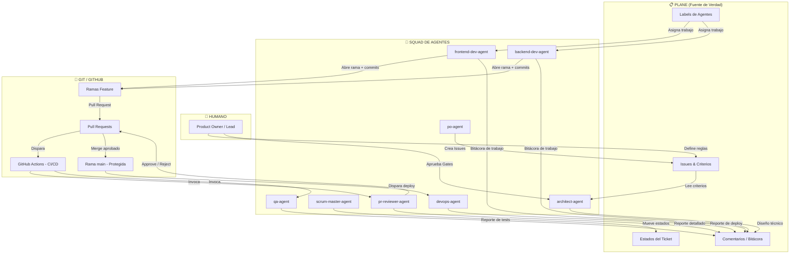
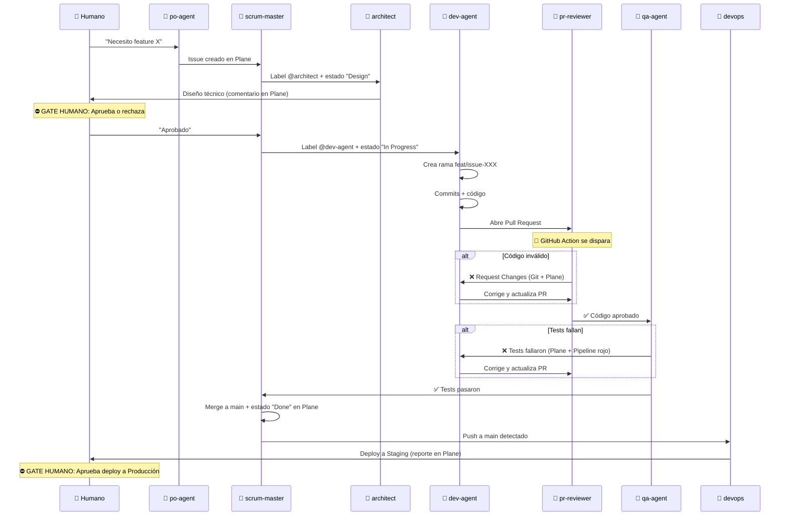
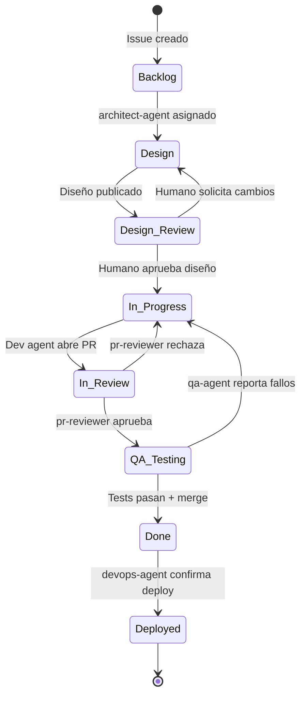
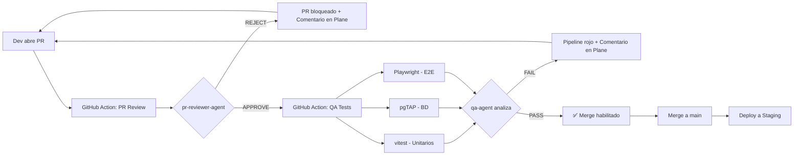

# 📘 Manual del Flujo Agéntico: Git × Plane × Humano

> **Versión:** 1.0  
> **Tipo:** Manual de referencia agnóstico al negocio  
> **Propósito:** Documentar exhaustivamente cómo un squad de agentes de IA orquesta el desarrollo de software usando Plane como fuente de verdad, Git como sistema de gobernanza de código y el Humano como autoridad final.

---

## Tabla de Contenidos

1. [Filosofía del Modelo](#1-filosofía-del-modelo)
2. [Los Tres Pilares](#2-los-tres-pilares)
3. [Mapa de Agentes y sus Canales](#3-mapa-de-agentes-y-sus-canales)
4. [Ciclo de Vida Completo de un Ticket](#4-ciclo-de-vida-completo-de-un-ticket)
5. [Protocolo de Comunicación Dual](#5-protocolo-de-comunicación-dual)
6. [Protocolo de Handoff entre Agentes](#6-protocolo-de-handoff-entre-agentes)
7. [Máquina de Estados de un Issue](#7-máquina-de-estados-de-un-issue)
8. [Gobernanza Humana: Los Gates](#8-gobernanza-humana-los-gates)
9. [Anatomía de un Pull Request Agéntico](#9-anatomía-de-un-pull-request-agéntico)
10. [El Pipeline CI/CD como Juez Automático](#10-el-pipeline-cicd-como-juez-automático)
11. [Resolución de Conflictos entre Agentes](#11-resolución-de-conflictos-entre-agentes)
12. [Anti-Patrones y Reglas de Seguridad](#12-anti-patrones-y-reglas-de-seguridad)
13. [Glosario](#13-glosario)

---

## 1. Filosofía del Modelo

### 1.1 El Problema que Resolvemos

En un equipo tradicional de software, la información vive fragmentada: los requerimientos están en una herramienta de gestión, el código en Git, las decisiones en emails o chats, y el estado real del proyecto en la cabeza de alguien. Cuando introduces agentes de IA al proceso, este problema se multiplica: los agentes pueden generar código a alta velocidad pero sin trazabilidad, sin contexto de negocio y sin rendición de cuentas.

### 1.2 La Solución: Triángulo de Gobernanza

Este modelo establece un **triángulo de gobernanza** donde cada vértice tiene una responsabilidad clara e inamovible:

```
                    👤 HUMANO
                   (Autoridad Final)
                  /                \
                 /   Aprueba Gates   \
                /    Define Reglas    \
               /                      \
              /                        \
     📋 PLANE ◄─────────────────────► 🔀 GIT
   (Fuente de Verdad)            (Gobernanza de Código)
   Qué hacer y por qué           Cómo se hizo
   Estado del proyecto            Historia técnica
   Bitácora de agentes            Revisión automatizada
```

**Principio fundamental:** Los agentes de IA son obreros altamente capaces pero **nunca** toman decisiones estratégicas. Ejecutan, documentan y rinden cuentas. El Humano gobierna.

### 1.3 Regla de Cero Confianza (Zero-Trust)

Ningún agente confía en el trabajo de otro agente. Cada entrega es auditada como si viniera de un desconocido. Esto se implementa mediante:

- **Separación de modelos de IA:** El agente que escribe el código no es el mismo modelo que lo revisa.
- **Auditoría cruzada:** El revisor no tiene acceso al "razonamiento" del desarrollador, solo al código final (caja negra).
- **Gates humanos:** En puntos críticos, el proceso se detiene hasta que el humano aprueba explícitamente.

---

## 2. Los Tres Pilares

### 2.1 Plane — La Fuente de Verdad del Proyecto

Plane es el **cerebro organizacional** del proyecto. Todo lo que importa para el negocio vive aquí:

| Elemento | Función |
|---|---|
| **Issues** | Unidad atómica de trabajo. Cada tarea que un agente ejecuta nace y muere como un Issue. |
| **Cycles (Sprints)** | Agrupación temporal del trabajo. Define qué se entrega y cuándo. |
| **Labels** | Mecanismo de asignación de agentes (ej. `@frontend-dev-agent`). |
| **States** | Máquina de estados que refleja el progreso real del trabajo. |
| **Comments** | Bitácora oficial. Cada agente documenta aquí qué hizo, por qué, y qué encontró. |

**Regla de oro:** Si algo no está en Plane, no existe. Un agente no puede trabajar en algo que no tenga un Issue abierto y asignado.

### 2.2 Git / GitHub — La Gobernanza del Código

Git es el **sistema judicial** del código. Ningún cambio llega a producción sin pasar por sus mecanismos de control:

| Elemento | Función |
|---|---|
| **Ramas (`feat/issue-XXX`)** | Aislamiento. Cada Issue se trabaja en su propia rama corta. |
| **Commits** | Registro atómico de cambios. Siguen Conventional Commits con referencia al Issue. |
| **Pull Requests** | Punto de inspección. El código se expone para revisión antes de fusionarse. |
| **GitHub Actions** | Automatización. Los agentes revisores y testers se ejecutan aquí como jueces imparciales. |
| **Branch Protection Rules** | Candado. `main` no acepta push directo; solo merges aprobados por el pipeline. |

**Regla de oro:** El historial de Git debe ser legible por cualquier desarrollador nuevo que se una al proyecto en el futuro. Cada commit cuenta una historia clara.

### 2.3 El Humano — La Autoridad Final

El Humano (Product Owner, Lead, Fundador) es el **gobernante** del sistema. Su rol no es escribir código ni gestionar tickets manualmente, sino:

1. **Definir las reglas de negocio** que los agentes deben respetar.
2. **Aprobar los Gates** (puntos de control críticos donde el proceso se detiene).
3. **Resolver ambigüedades** que los agentes no pueden decidir por sí mismos.
4. **Auditar la bitácora** en Plane para verificar que los agentes están haciendo lo correcto.

**Regla de oro:** El Humano nunca debe necesitar leer código para entender qué está pasando en el proyecto. La bitácora en Plane debe ser suficiente.

---

## 3. Mapa de Agentes y sus Canales

Cada agente del squad interactúa con uno o ambos pilares (Plane y Git). La siguiente tabla define **exactamente** qué hace cada agente en cada canal:

### 3.1 Matriz de Interacciones

| Agente | Lee de Plane | Escribe en Plane | Lee de Git | Escribe en Git | Interactúa con Humano |
|---|---|---|---|---|---|
| `architect-agent` | ✅ Issues, Criterios | ✅ Comentarios de diseño | ❌ | ❌ (no escribe código) | ✅ Presenta diseños para aprobación |
| `po-agent` | ✅ Backlog existente | ✅ Crea/actualiza Issues | ❌ | ❌ | ✅ Traduce requerimientos del humano |
| `scrum-master-agent` | ✅ Cycles, States | ✅ Mueve estados, reporta | ❌ | ❌ | ✅ Reporta estado del sprint |
| `designer-agent` | ✅ Issues de UI | ✅ Comentarios de diseño | ❌ | ✅ Tokens CSS/diseño | ⚪ Bajo demanda |
| `frontend-dev-agent` | ✅ Issue asignado | ✅ Bitácora de inicio/fin | ✅ Contratos | ✅ Código + Commits + PR | ❌ |
| `backend-dev-agent` | ✅ Issue asignado | ✅ Bitácora de inicio/fin | ✅ Contratos | ✅ Código + Commits + PR | ❌ |
| `pr-reviewer-agent` | ✅ Criterios del Issue | ✅ Reporte de revisión | ✅ Diff del PR | ✅ Approve/Reject en PR | ❌ |
| `qa-agent` | ✅ Criterios Gherkin | ✅ Reporte de tests | ✅ Código para testear | ✅ Archivos de test | ❌ |
| `devops-agent` | ✅ Issue de deploy | ✅ Reporte de deploy | ✅ Pipeline configs | ✅ CI/CD workflows | ⚪ Bajo demanda |
| `automation-agent` | ✅ Issues de n8n | ✅ Bitácora de workflows | ❌ | ✅ Configs de n8n | ❌ |

### 3.2 Diagrama de Flujo de Información



---

## 4. Ciclo de Vida Completo de un Ticket

Esta sección describe paso a paso lo que sucede desde que nace una necesidad hasta que el código está en producción. Es el flujo más importante de este manual.

### Fase 0: Nacimiento del Issue (Humano → Plane)

**Quién actúa:** El Humano, opcionalmente asistido por el `po-agent`.

1. El Humano identifica una necesidad de negocio (ej. "Los clientes necesitan poder pagar con PIX").
2. El `po-agent` (si se invoca) traduce esa necesidad en un Issue estructurado con:
   - Título claro.
   - Descripción del problema.
   - Historias de usuario ("Como X, quiero Y, para Z").
   - Criterios de aceptación en formato Gherkin (`Given - When - Then`).
3. El Issue se crea en Plane con estado **Backlog**.

**Registro en Plane:**
> 🤖 @po-agent: "Se creó el Issue ISSUE-303: Payment Method at Checkout — PIX / Cash with Change. Incluye 3 criterios de aceptación Gherkin validados con el Product Owner."

### Fase 1: Diseño Técnico (architect-agent)

**Quién actúa:** `architect-agent`  
**Disparador:** El Humano o el `scrum-master-agent` asigna la etiqueta `@architect-agent` al Issue.

1. El arquitecto lee el Issue en Plane (criterios de aceptación, historia de usuario).
2. Diseña la solución técnica: contratos de datos (Zod/JSON), esquema de BD, diagramas.
3. Publica el diseño como comentario detallado en el Issue de Plane.
4. **GATE HUMANO:** El proceso se detiene aquí. El Humano debe revisar y aprobar el diseño antes de que cualquier agente escriba código.

**Registro en Plane:**
> 🤖 @architect-agent: "Diseño técnico publicado. Se requieren 2 tablas nuevas y 1 función RPC. El contrato Zod propuesto tiene 4 campos obligatorios. Esperando aprobación del Product Owner."

**En Git:** Nada. El arquitecto no toca código.

### Fase 2: Ejecución del Código (dev-agents)

**Quién actúa:** `frontend-dev-agent` y/o `backend-dev-agent`  
**Disparador:** El Humano aprueba el diseño. El `scrum-master-agent` mueve el Issue a **In Progress** y reasigna la etiqueta al agente desarrollador correspondiente.

1. El agente desarrollador lee el Issue y el diseño técnico aprobado en Plane.
2. Crea una rama en Git: `feat/issue-XXX`.
3. Escribe el código siguiendo estrictamente los contratos definidos por el arquitecto.
4. Hace commits atómicos con mensajes limpios siguiendo Conventional Commits.
5. Al terminar, abre un Pull Request hacia `main`.
6. Deja un comentario en el Issue de Plane documentando qué hizo.

**Registro en Plane:**
> 🤖 @backend-dev-agent: "Implementación completada. Se crearon 2 archivos de migración SQL y 1 función RPC. Se abrió el PR #5 en GitHub para revisión. Todos los contratos Zod del arquitecto fueron respetados sin modificación."

**En Git:**
```
feat(payments): add PIX payment method to checkout RPC

- New column payment_method in pedidos table
- RPC validates allowed values: 'pix', 'cash', 'card'
- Cash requires troco_para field > 0

Refs: CENTERGAS-66
```

### Fase 3: Revisión Estática del PR (pr-reviewer-agent)

**Quién actúa:** `pr-reviewer-agent`  
**Disparador:** Automático. El Pull Request dispara un GitHub Action que invoca al agente.

1. El Action extrae el `git diff` del PR.
2. El Action identifica el Issue asociado (del título del PR).
3. El `pr-reviewer-agent` recibe el diff y consulta Plane para leer los criterios de aceptación del Issue.
4. Compara línea por línea el código contra los contratos y los criterios Gherkin.
5. Emite un veredicto:
   - **APPROVE:** El código cumple. Se deja un comentario de aprobación en Plane y en el PR.
   - **REJECT:** El código viola alguna regla. Se bloquea el PR (`Request Changes`) y se deja un comentario detallado en Plane explicando qué falló y por qué.

**Si APRUEBA — Registro en Plane:**
> 🤖 @pr-reviewer-agent: "PR #5 APROBADO. El código cumple los 3 criterios de aceptación del Issue. La política RLS es correcta. El cálculo de precios se ejecuta server-side. Listo para fase de QA."

**Si RECHAZA — Registro en Plane:**
> 🤖 @pr-reviewer-agent: "PR #5 RECHAZADO. Motivo: El campo `payment_method` acepta valores arbitrarios del cliente (línea 34 del diff). Según el criterio de aceptación #2, los valores deben validarse contra una lista cerrada en el servidor. Solicito corrección al @backend-dev-agent."

**En Git:** Approve o Request Changes directamente en el PR de GitHub.

### Fase 4: Pruebas Dinámicas (qa-agent)

**Quién actúa:** `qa-agent`  
**Disparador:** El PR pasa la revisión estática. Un segundo GitHub Action invoca al agente de QA.

1. Se ejecutan los tests automatizados (unitarios, integración, E2E).
2. El `qa-agent` analiza los resultados.
3. Si hay fallos, documenta en Plane exactamente qué escenario Gherkin no se cumplió, con evidencia.
4. Si todo pasa, confirma en Plane que los tests son exitosos.

**Registro en Plane:**
> 🤖 @qa-agent: "Suite de tests ejecutada. Resultados: ✅ 12 unitarios pasados, ✅ 3 tests de RLS pasados, ✅ 2 tests E2E pasados. Cobertura de criterios Gherkin: 100%. Listo para merge."

### Fase 5: Merge a Main

**Quién actúa:** GitHub Actions (automático) o el Humano (si se requiere aprobación manual final).  
**Disparador:** El PR tiene todas las verificaciones en verde.

1. El código se fusiona a `main`.
2. El `scrum-master-agent` (o el pipeline) mueve el Issue en Plane a **Done**.
3. Se deja un comentario final de cierre en Plane.

**Registro en Plane:**
> 🤖 @scrum-master-agent: "ISSUE-303 cerrado exitosamente. PR #5 fusionado a main. Tiempo total de ciclo: 4 horas. El feature estará disponible en el próximo deploy a staging."

### Fase 6: Deploy (devops-agent)

**Quién actúa:** `devops-agent`  
**Disparador:** Push a `main` dispara el pipeline de deploy.

1. Se despliega a Staging.
2. El agente verifica que el deploy fue exitoso.
3. Documenta en Plane la URL de staging y el estado.

**Registro en Plane:**
> 🤖 @devops-agent: "Deploy a Staging exitoso. URL: https://staging.example.com. Build #42. Todos los health checks pasaron. Pendiente: aprobación del Product Owner para deploy a Producción."

---

## 5. Protocolo de Comunicación Dual

### 5.1 Regla General

| Canal | Audiencia | Tono | Contenido |
|---|---|---|---|
| **Plane** | PO, Scrum Master, Stakeholders | Profesional, detallado, orientado al negocio | Qué se hizo, por qué, qué regla se validó/violó, impacto, próximo paso |
| **Git** | Desarrolladores (humanos o agentes) | Técnico, conciso, estandarizado | Qué cambió en el código, referencia al Issue |

### 5.2 Plantilla de Comentario en Plane (Obligatoria)

Todos los agentes deben usar esta estructura al escribir en Plane:

```markdown
### 🤖 Reporte de [@nombre-del-agente]

**Fecha:** YYYY-MM-DD HH:MM UTC
**Acción realizada:** [Verbo + descripción clara]
**Issue:** ISSUE-XXX

---

#### 📋 Resumen ejecutivo
[2-3 oraciones explicando qué se logró o detectó.
Usar lenguaje de negocio. Prohibido usar jerga de código
como "refactoring", "dependency injection" o "middleware".
En su lugar: "Se reorganizó la lógica", "Se conectó el módulo de pagos",
"Se agregó una capa de seguridad".]

#### ✅ Qué se cumplió
- [Criterio de aceptación verificado, en lenguaje de negocio]

#### ❌ Qué falló (si aplica)
- [Problema encontrado, explicado para un no-desarrollador]
- [Impacto en el negocio o en el usuario final]

#### 🔄 Próximo paso
- [Acción concreta que debe ocurrir ahora]

#### 📎 Referencias
- PR en GitHub: [#N](link) (si aplica)
- Rama: `feat/issue-XXX` (si aplica)
- Archivos principales: [lista breve, sin rutas completas]
```

### 5.3 Formato de Commits en Git (Obligatorio)

```
<tipo>(scope): descripción corta en imperativo

[cuerpo opcional: detalle técnico para desarrolladores]

Refs: PROYECTO-<id>
```

Tipos: `feat`, `fix`, `refactor`, `chore`, `test`, `docs`, `ci`

### 5.4 Formato de Títulos de PR (Obligatorio)

```
[ISSUE-XXX] Descripción clara y breve del cambio
```

---

## 6. Protocolo de Handoff entre Agentes

El "handoff" es el momento en que un agente termina su trabajo y le pasa la responsabilidad al siguiente. Este protocolo define **exactamente** cómo ocurre cada transición.

### 6.1 Tabla de Handoffs

| De → A | Mecanismo en Plane | Mecanismo en Git | Condición de Activación |
|---|---|---|---|
| Humano → `po-agent` | Humano describe necesidad | — | Instrucción verbal/escrita |
| `po-agent` → `architect-agent` | Issue creado + Label `@architect-agent` | — | Issue en estado "Backlog" con label |
| `architect-agent` → Humano | Comentario con diseño técnico | — | **GATE:** Espera aprobación |
| Humano → `dev-agent` | Aprobación + Label `@dev-agent` | — | Humano aprueba diseño |
| `dev-agent` → `pr-reviewer-agent` | Comentario "PR abierto" | PR creado en GitHub | PR apunta a `main` |
| `pr-reviewer-agent` → `dev-agent` | Comentario "RECHAZADO" + motivo | Request Changes en PR | Código no cumple |
| `pr-reviewer-agent` → `qa-agent` | Comentario "APROBADO" | Approve en PR | Código cumple |
| `qa-agent` → `dev-agent` | Comentario "TESTS FALLARON" | Pipeline falla | Tests no pasan |
| `qa-agent` → Merge | Comentario "TESTS PASARON" | Pipeline verde | Tests pasan |
| Merge → `devops-agent` | Estado cambia a "Done" | Push a `main` | Merge exitoso |

### 6.2 Diagrama de Handoffs



---

## 7. Máquina de Estados de un Issue

Cada Issue en Plane sigue una máquina de estados estricta. Los agentes solo pueden mover un Issue al estado que les corresponde según su rol.



### 7.1 Permisos por Agente

| Estado | Quién puede mover a este estado |
|---|---|
| **Backlog** | `po-agent`, Humano |
| **Design** | `scrum-master-agent` |
| **Design Review** | `architect-agent` |
| **In Progress** | Humano (post-aprobación), `scrum-master-agent` |
| **In Review** | `frontend-dev-agent`, `backend-dev-agent` |
| **QA Testing** | `pr-reviewer-agent` |
| **Done** | `qa-agent` (post-tests), `scrum-master-agent` |
| **Deployed** | `devops-agent` |

---

## 8. Gobernanza Humana: Los Gates

Los Gates son **puntos de bloqueo obligatorio** donde el proceso se detiene hasta que el Humano toma una decisión. Ningún agente puede saltarse un Gate.

### 8.1 Lista de Gates

| Gate | Momento | Qué revisa el Humano | Qué pasa si no aprueba |
|---|---|---|---|
| **Gate 1: Diseño** | Después de que el arquitecto publica su diseño | ¿La solución técnica resuelve el problema de negocio? ¿Es viable? | El arquitecto rediseña |
| **Gate 2: Deploy a Producción** | Después de que el código está en Staging | ¿El feature funciona como se esperaba en un entorno real? | Se abre un Issue de corrección |
| **Gate 3: Cambio de Alcance** | Si un agente detecta que el Issue requiere más trabajo del planeado | ¿Se acepta el trabajo adicional o se recorta el alcance? | Se re-prioriza en Plane |

### 8.2 Cómo se implementa un Gate

1. El agente que llega al Gate deja un comentario en Plane con toda la información necesaria para que el Humano decida.
2. El agente cambia el estado del Issue a "Awaiting Approval" o equivalente.
3. El proceso **se detiene**. Ningún otro agente actúa hasta que el Humano responde.
4. El Humano responde con un comentario en Plane: "Aprobado" o "Cambios necesarios: [detalle]".
5. El `scrum-master-agent` lee la respuesta y mueve el Issue al siguiente estado.

---

## 9. Anatomía de un Pull Request Agéntico

Un PR creado por un agente de desarrollo debe tener esta estructura:

### 9.1 Título
```
[ISSUE-XXX] Descripción clara del cambio
```

### 9.2 Cuerpo del PR
```markdown
## Descripción
Breve explicación de lo que hace este PR.

## Issue relacionado
Resuelve ISSUE-XXX: [título del Issue]

## Cambios realizados
- [Lista de cambios principales]

## Contratos respetados
- [Lista de contratos/schemas que se siguieron]

## Checklist del agente
- [ ] Código sigue los contratos del architect-agent
- [ ] Commits siguen Conventional Commits
- [ ] No se introdujeron dependencias no autorizadas
- [ ] Bitácora dejada en Plane (Issue correspondiente)
```

### 9.3 Reglas del PR
- Un PR = Un Issue. No se mezclan cambios de múltiples Issues.
- La rama debe llamarse `feat/issue-XXX`, `fix/issue-XXX` o `chore/issue-XXX`.
- El PR debe tener el Issue ID en el título para que el pipeline lo extraiga automáticamente.

---

## 10. El Pipeline CI/CD como Juez Automático

El pipeline de GitHub Actions actúa como un **sistema judicial automatizado** que garantiza que ningún código defectuoso llegue a `main`.

### 10.1 Diagrama del Pipeline



### 10.2 Secretos Necesarios en GitHub

| Secreto | Propósito |
|---|---|
| `GEMINI_API_KEY` | Única key necesaria. Todos los modelos del squad (Gemini Pro, Flash, Claude Opus, Sonnet) se acceden a través de la suscripción de Gemini |
| `PLANE_API_KEY` | Para que los agentes lean Issues y dejen comentarios en Plane |
| `SUPABASE_DB_URL` | Para ejecutar tests de BD en el pipeline |

---

## 11. Resolución de Conflictos entre Agentes

### 11.1 Escenario: El revisor rechaza, pero el desarrollador insiste

1. El `pr-reviewer-agent` deja un comentario detallado de rechazo en Plane.
2. El `dev-agent` corrige y reabre el PR.
3. Si el ciclo se repite más de **3 veces**, el Issue se escala automáticamente al Humano con el estado "Needs Human Decision".
4. El Humano revisa ambos argumentos (del revisor y del desarrollador) en la bitácora de Plane y toma la decisión final.

### 11.2 Escenario: El arquitecto y el PO no están de acuerdo

1. El `architect-agent` publica su diseño en Plane con una nota de que hay una discrepancia con el requerimiento original.
2. El Issue se mueve a "Needs Clarification".
3. El Humano decide.

### 11.3 Regla de Escalación

> **Si un agente no puede resolver un problema en 3 intentos, el Issue se escala al Humano. Siempre.**

---

## 12. Anti-Patrones y Reglas de Seguridad

### 12.1 Lo que los agentes NUNCA deben hacer

| Anti-Patrón | Por qué es peligroso |
|---|---|
| Trabajar sin un Issue en Plane | No hay trazabilidad. Si algo sale mal, no hay registro de por qué se hizo. |
| Hacer push directo a `main` | Salta todas las validaciones del pipeline. Código inseguro podría llegar a producción. |
| Asumir un contrato no definido | El agente inventa estructuras de datos que no existen, creando incompatibilidades. |
| Modificar código de otro agente sin pasar por PR | Rompe la cadena de revisión Zero-Trust. |
| Dejar de documentar en Plane | El PO pierde visibilidad. El proyecto se vuelve una caja negra. |
| Auto-aprobarse | El mismo modelo que escribe el código NO puede ser el que lo revisa. |

### 12.2 Reglas de Seguridad del Pipeline

1. La rama `main` tiene **Branch Protection Rules** activadas:
   - No se permite push directo.
   - Se requiere al menos 1 revisión aprobada (del `pr-reviewer-agent`).
   - Se requiere que todos los checks del CI pasen.
2. Los secretos de API nunca se hardcodean en el código.
3. Las migraciones de BD se ejecutan primero en Staging, nunca directamente en Producción.

---

## 13. Glosario

| Término | Definición |
|---|---|
| **Agent / Agente** | Un modelo de IA especializado con un rol definido (arquitecto, desarrollador, revisor, etc.) que ejecuta tareas dentro de reglas estrictas. |
| **Gate** | Punto de control donde el proceso se detiene hasta que el Humano aprueba. |
| **Handoff** | Momento en que un agente termina su trabajo y pasa la responsabilidad al siguiente. |
| **Issue** | Unidad atómica de trabajo en Plane. Todo lo que se hace en el proyecto nace y muere como un Issue. |
| **Zero-Trust** | Filosofía de seguridad donde ningún agente confía en el trabajo de otro. Todo se audita. |
| **Bitácora** | Registro cronológico de comentarios en Plane que documenta cada acción de cada agente. |
| **Conventional Commits** | Estándar de mensajes de commit que usa prefijos como `feat:`, `fix:`, `chore:` para clasificar cambios. |
| **Fuente de Verdad** | El sistema que contiene la información oficial y actualizada del proyecto. En este modelo, es Plane. |
| **Pipeline** | Secuencia automatizada de pasos (build, test, review, deploy) que se ejecuta en GitHub Actions. |
| **Branch Protection** | Regla de GitHub que impide modificar la rama `main` directamente, obligando a pasar por PR y revisiones. |
| **MCP (Model Context Protocol)** | Protocolo que permite a los agentes de IA interactuar con herramientas externas (como Plane o Supabase) de forma estandarizada. |
| **Squad** | El conjunto completo de agentes de IA que operan como un equipo. |

---

> *Este manual es un documento vivo. Debe actualizarse cada vez que se modifique el flujo agéntico, se agregue un nuevo agente, o se cambie una regla de gobernanza.*
