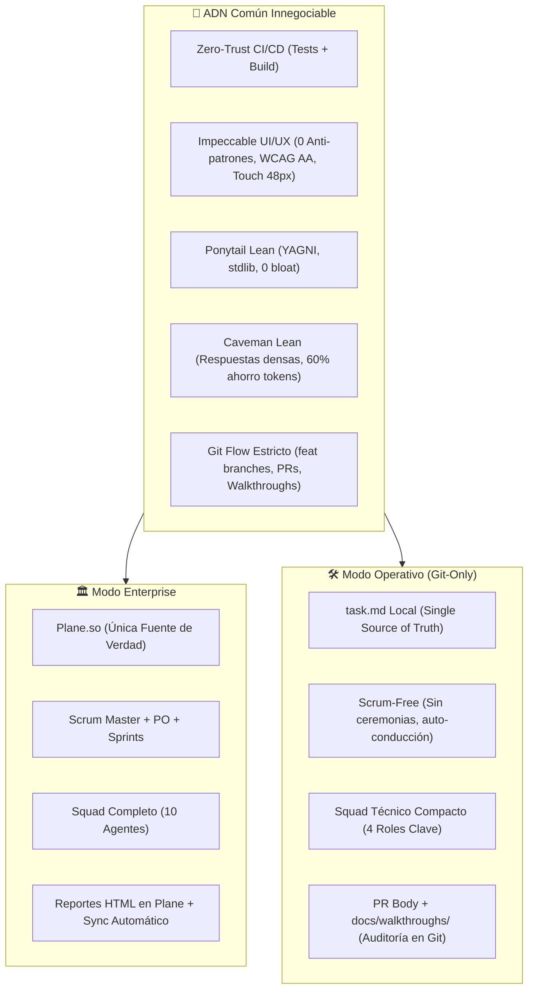

# 🏛️ Documento de Arquitectura: Modos Duales del Flujo Agéntico (Enterprise vs. Operativo)

> **Autor:** Antigravity Squad (Arquitecto Principal)  
> **Fecha:** 2026-09-07  
> **Estado:** Aprobado / Implementado  
> **Referencia:** `[ISSUE-806]`

---

## 1. Motivación y Problema Arquitectónico

Hasta la versión 5 del ciclo de desarrollo, el **Antigravity Squad** operaba bajo una dependencia acoplada con **Plane.so** y ceremonias de **Scrum**. Aunque este modelo proporciona una trazabilidad total para proyectos de nivel empresarial con múltiples partes interesadas, introduce fricciones innecesarias en dos escenarios comunes:

1. **Desarrollo Rápido / Prototipos / MVPs:** Configurar Plane, crear proyectos, mapear IDs de estados y configurar tokens de API agrega overhead cognitivo y de configuración cuando un desarrollador solo desea programar con agentes autónomos y Git.
2. **Portabilidad a Nuevos Repositorios:** Exportar el flujo agéntico a un nuevo proyecto requería duplicar configuraciones propietarias y dependencias de servicios externos.

Para resolver esto sin sacrificar el rigor de ingeniería, diseñamos una **Arquitectura Dual Desacoplada**.

---

## 2. Comparativa Arquitectónica de Modos



### Tabla de Diferenciación Técnica

| Dimensión | 🏛️ Modo Enterprise | 🛠️ Modo Operativo |
| :--- | :--- | :--- |
| **Fuente de Verdad** | Plane.so (`issues`, `states`, `cycles`, `comments`) | `task.md` + Git log + Pull Requests |
| **Gobernanza de Negocio** | Product Owner Agent + Scrum Master Agent | Humano directo en el chat / Prompt directo |
| **Estructura del Squad** | 10 agentes especializados | 4 agentes clave: Arquitecto, Frontend, Backend, QA |
| **Requisitos de Tokens/API** | Plane API Key + Workspace Slug + Project ID | 0 tokens externos requeridos |
| **Configuración de MCP** | Servidor Plane MCP + Playwright MCP | Solo Playwright MCP (Testing local) |
| **Cierre de Tarea** | Commit + Push + PR + Walkthrough + Plane Update (HTML) | Commit + Push + PR + Walkthrough |
| **Velocidad de Arranque** | ~5-10 minutos (Setup de proyecto en Plane) | < 30 segundos (1 comando bash) |

---

## 3. ADN Compartido (Calidad y Rigor Técnico)

Independientemente del modo elegido, **ambos modos comparten el 100% de los principios de ingeniería**:

1. **Zero-Trust CI/CD:** Todo código debe compilar limpiamente (`build`) y pasar los tests unitarios y de integración antes de fusionarse.
2. **Impeccable UI/UX:** Cero emojis unicode en interfaz de producción, contratos visuales según tokens de diseño, ergonomía táctil mínima de 48px, y contraste WCAG 2.1 AA. Verificado mecánicamente mediante `impeccable detect`.
3. **Ponytail Architecture:** Escalera YAGNI estricta. Ninguna abstracción de un solo uso, aprovechamiento de la biblioteca estándar y plataforma nativa antes de instalar dependencias externas.
4. **Caveman Communication:** Respuestas directas, condensadas, de alta densidad técnica sin relleno conversacional para maximizar la ventana de contexto y reducir costos de inferencia.
5. **Git Flow:** Prohibición absoluta de comitear a `main`. Todo cambio vive en una rama `feat/...` o `fix/...`, respaldado por un Pull Request y evidencia en `docs/walkthroughs/`.

---

## 4. Estructura de Plantillas en el Repositorio

El sistema está empaquetado bajo `templates/agentic-flow/`:

```text
templates/agentic-flow/
├── core-skills/
│   ├── impeccable/            # Skill de auditoría y diseño UI/UX
│   ├── caveman/               # Skill de tokens y comunicación ultra-densa
│   └── ponytail/              # Skill de minimalismo arquitectónico y anti-bloat
├── mode-operative/
│   ├── rules/superules.md     # Reglas adaptadas al flujo local Git
│   ├── AGENTS.md              # Definición de squad compacto
│   ├── task-template.md       # Plantilla de memoria para la tarea
│   ├── .env.example           # Variables limpias sin Plane
│   └── mcp_config.template.json
└── mode-enterprise/
    ├── rules/superules.md     # Reglas con protocolo obligatorio de Plane
    ├── AGENTS.md              # Definición del squad de 10 agentes
    ├── task-template.md       # Plantilla con cierre en Plane
    ├── .env.example           # Variables completas con Plane
    └── mcp_config.template.json
```

---

## 5. El Script de Inicialización y Diagnóstico (`init-agentic-flow.sh`)

El archivo `scripts/init-agentic-flow.sh` es un instalador autónomo escrito en bash POSIX que realiza las siguientes operaciones:

1. **Detección y Creación de Git:** Inicializa el repositorio si no existe y detecta la rama activa.
2. **Copia Atómica de Reglas y Skills:** Copia `.agents/rules/superules.md`, `AGENTS.md` y las 3 skills maestras (`impeccable`, `caveman`, `ponytail`).
3. **Configuración de `.env` Segura:** Crea un `.env` a partir de `.env.example` sin sobrescribir secretos existentes si el archivo ya existe.
4. **Blindaje de `.gitignore`:** Asegura que `.env`, `.env.local` y carpetas de build queden excluidos del rastreo de Git.
5. **Generación de MCP:** Parsea `.env` y genera `.agents/mcp_config.json` con los valores reales.
6. **Modo Doctor (`--check-env`):** Realiza un análisis estático de dependencias (`git`, `gh`, variables `.env`, presencia de skills) y reporta el estado operativo.

---

## 6. Conclusión y Futuro

La arquitectura dual desacoplada permite que el estándar de desarrollo de Center Gás sea instantáneamente portable a cualquier nuevo proyecto en la organización o en proyectos de terceros, reduciendo a cero el tiempo de adopción de prácticas de desarrollo asistidas por IA de clase mundial.
