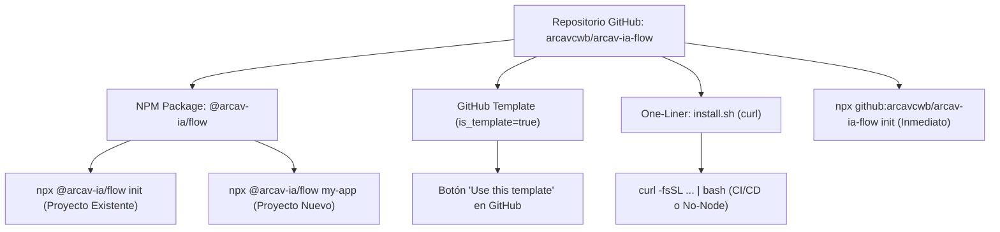

# Implementation Plan: Repositorio Oficial y CLI `@arcav-ia/flow`

## 🎯 Resumen Ejecutivo y Alcance
Crear, empaquetar y publicar en GitHub el repositorio oficial **`arcavcwb/arcav-ia-flow`** bajo el nombre de paquete **`@arcav-ia/flow`**.

Este proyecto proporciona una solución universal y zero-friction para inicializar el **Antigravity Agentic Flow** en cualquier proyecto (nuevo o preexistente) con:
1. **CLI NPX Instantáneo:** Invocable vía `npx @arcav-ia/flow` (en NPM) o directamente vía `npx github:arcavcwb/arcav-ia-flow` (sin necesidad de publicar previamente en registro NPM).
2. **GitHub Template Repository:** Repositorio público con la marca `is_template=true` para inicializaciones 1-clic desde la web de GitHub.
3. **8 Core Skills Maestras:** Preempaquetadas y listas para usar (`impeccable`, `caveman`, `ponytail`, `contract-first-api`, `vite-modernizer`, `web-vitals-heavy-media`, `pnpm-monorepo-architect`, `playwright-e2e-suite`).
4. **Modos Duales:** Modo Operativo (Git-Only ágil) y Modo Enterprise (Plane.so + Scrum).
5. **Doctor Integrado (`--doctor`):** Diagnóstico automático de salud del entorno.
6. **Documentación de Alto Impacto:** Guías especializadas de gobernanza, catálogo de skills y arquitectura.



---

## ⚠️ User Review Required

> [!IMPORTANT]
> **Nombre del Repositorio en GitHub:**
> El paquete se llamará en `package.json`: **`@arcav-ia/flow`**.
> En GitHub, tu cuenta personal activa es **`arcavcwb`**. Por tanto, el repositorio se creará como:
> 👉 **`https://github.com/arcavcwb/arcav-ia-flow`**
> Esto permite que cualquier persona ejecute:
> ```bash
> npx github:arcavcwb/arcav-ia-flow init
> ```
> de forma inmediata desde el minuto 1. Posteriormente, al ejecutar `npm publish --access public`, estará disponible como `npx @arcav-ia/flow`.

> [!TIP]
> **Arquitectura Zero-Dependency:**
> El CLI estará programado en Node.js ESM nativo sin dependencias de terceros pesadas. Esto asegura que la descarga y ejecución por `npx` ocurra en menos de 2 segundos.

---

## 📦 Estructura del Repositorio (`arcav-ia-flow`)

El nuevo repositorio `/home/arcav/projects/arcav-ia-flow` tendrá la siguiente estructura:

```
arcav-ia-flow/
├── bin/
│   └── cli.js                    # Shebang #!/usr/bin/env node ejecutable
├── src/
│   ├── index.js                  # Orquestador del CLI
│   ├── ui.js                     # Terminal UI (colores ANSI, banner ASCII y menú interactivo)
│   ├── scaffolder.js             # Lógica de inyección y copiado de archivos
│   ├── doctor.js                 # Diagnóstico de entorno y comprobación de skills
│   └── utils.js                  # Utilidades de FS, Git y package.json
├── templates/
│   ├── core-skills/              # 8 Skills canónicas
│   │   ├── impeccable/
│   │   ├── caveman/
│   │   ├── ponytail/
│   │   ├── contract-first-api/
│   │   ├── vite-modernizer/
│   │   ├── web-vitals-heavy-media/
│   │   ├── pnpm-monorepo-architect/
│   │   └── playwright-e2e-suite/
│   ├── mode-operative/           # Reglas, AGENTS.md, task-template y MCP para Git-Only
│   └── mode-enterprise/          # Reglas con Plane.so, sprints y trazabilidad
├── docs/
│   ├── ARCHITECTURE.md           # Diagramas y funcionamiento interno
│   ├── SKILLS_GUIDE.md           # Guía exhaustiva de las 8 skills
│   └── GOVERNANCE.md             # Filosofía Zero-Trust, Anti-Olvido y Git Flow
├── install.sh                    # Script shell para curl/bash
├── package.json                  # @arcav-ia/flow + bin configuration
├── LICENSE                       # MIT
└── README.md                     # Documentación principal visual y concisa
```

---

## 🛠️ Detalle de Componentes a Desarrollar

### Componente 1: Núcleo del CLI (`bin/cli.js` & `src/`)

#### [NEW] `bin/cli.js`
- Entrada ejecutable que parsea argumentos CLI:
  - `init` o `.`: Inyecta en el directorio actual.
  - `<nombre-proyecto>`: Crea un nuevo proyecto en una subcarpeta.
  - `--mode <operative|enterprise>`: Selecciona modo sin prompt.
  - `--doctor` o `--check-env`: Ejecuta el diagnóstico de salud.
  - `--yes` o `-y`: Modo no interactivo para CI/CD.
  - `-h, --help` y `-v, --version`.

#### [NEW] `src/ui.js`
- Renderiza el banner visual de `@arcav-ia/flow`:
  ```
  ╔═══════════════════════════════════════════════════════════╗
  ║           ⚡ @arcav-ia/flow — Antigravity CLI ⚡           ║
  ║       Zero-Trust Agentic Architecture & Governance        ║
  ╚═══════════════════════════════════════════════════════════╝
  ```
- Menú interactivo basado en `readline/promises` nativo (cero dependencias).

#### [NEW] `src/scaffolder.js`
- Verifica e inicializa Git si el proyecto es nuevo (`git init`).
- Copia de manera segura los directorios:
  - `.agents/rules/superules.md`
  - `.agents/skills/[8 skills maestras]`
  - `AGENTS.md`
  - `task.md` (con el anclaje obligatorio anti-olvido)
  - `.env.example` y `.env` inicial
  - `.agents/mcp_config.json`
  - `docs/walkthroughs/README.md`
- Inyecta el script `"check:design": ".agents/skills/impeccable/scripts/impeccable detect"` en `package.json` si existe.
- Blinda el `.gitignore` con exclusiones de seguridad (`.env`, `node_modules/`, etc.).

#### [NEW] `src/doctor.js`
- Chequea:
  1. Estado del repositorio Git.
  2. Estado de autenticación de GitHub CLI (`gh auth status`).
  3. Presencia y validez de `.env`.
  4. Presencia de las **8/8 skills maestras** en `.agents/skills/`.
  5. Script de verificación de diseño en `package.json`.
- Devuelve código de salida `0` si todo está perfecto o `1` con advertencias claras.

---

### Componente 2: Catálogo de 8 Core Skills Integradas

Se empaquetan las 8 skills probadas en producción:
1. **`impeccable`**: Protocolo mandatorio UI/UX, cero emojis unicode, 48px touch targets, WCAG 2.1 AA.
2. **`caveman`**: Protocolo de comunicación concisa y tokens lean (reduce 40-70% el gasto de contexto).
3. **`ponytail`**: Filosofía de arquitectura lean, escalera YAGNI y cero sobre-ingeniería.
4. **`contract-first-api`**: Modelado estricto Zod y validación runtime defensiva (`safeParse`).
5. **`vite-modernizer`**: Modernización quirúrgica de frontend a Vite + TypeScript.
6. **`web-vitals-heavy-media`**: Optimización de Core Web Vitals (LCP, CLS, INP) en assets pesados.
7. **`pnpm-monorepo-architect`**: Gobernanza de Monorepos con pnpm workspaces y Turborepo.
8. **`playwright-e2e-suite`**: Automatización E2E determinista con selectores de accesibilidad.

---

### Componente 3: Documentación de Alto Impacto

#### [NEW] `README.md`
- **Hero & Badge Status**: Badges de NPM, License MIT, Node 18+, Zero Dependencies.
- **Quickstart (5 segundos)**:
  ```bash
  # En cualquier proyecto existente:
  npx @arcav-ia/flow init
  
  # O ejecución directa desde GitHub:
  npx github:arcavcwb/arcav-ia-flow init
  
  # Para crear un nuevo proyecto:
  npx @arcav-ia/flow my-new-app
  ```
- **Matriz de Modos**: Tabla comparativa clara entre **Modo Operativo** (Git-first) vs **Modo Enterprise** (Plane.so + Scrum).
- **Catálogo de Skills**: Tabla de las 8 skills con disparadores y descripción.
- **Doctor Diagnostics**: Guía de uso del flag `--doctor`.

#### [NEW] `docs/SKILLS_GUIDE.md`
- Manual detallado con ejemplos de uso, reglas de activación y mejores prácticas para cada skill.

#### [NEW] `docs/GOVERNANCE.md`
- La filosofía Zero-Trust del Antigravity Squad.
- Regla Estricta Anti-Olvido.
- Ciclo de vida de Issues, PRs y Walkthroughs.

#### [NEW] `docs/ARCHITECTURE.md`
- Flujos de inyección, estructura interna y portabilidad multiplataforma.

---

### Componente 4: Despliegue en GitHub y Template

#### [NEW] Repositorio Remoto `arcavcwb/arcav-ia-flow`
- Creación vía `gh repo create arcavcwb/arcav-ia-flow --public --source . --push`.
- Configuración como GitHub Template Repository:
  ```bash
  gh api -X PATCH /repos/arcavcwb/arcav-ia-flow -F is_template=true
  ```
- Generación de topics/tags en GitHub (`antigravity`, `ai-agents`, `agentic-workflow`, `cli`, `template`, `developer-tools`).

---

## 🧪 Plan de Verificación Zero-Trust

### Pruebas Automatizadas y de Entorno
1. **Ejecución Local del CLI:**
   - Probar `./bin/cli.js --doctor` en el propio repo.
   - Probar `./bin/cli.js --help` y `--version`.
2. **Prueba de Inyección en Sandbox Existente:**
   - Inyectar en `/home/arcav/projects/react-apod-app` ejecutando `node /home/arcav/projects/arcav-ia-flow/bin/cli.js init --mode operative`.
   - Verificar inyección de las 8 skills y comprobación Doctor.
3. **Prueba de Creación de Proyecto Nuevo:**
   - Crear un proyecto temporal en `/tmp/test-agentic-app` con el CLI.
   - Verificar inicialización de git, estructura `.agents/` y archivos de configuración.
4. **Prueba Remota Inmediata con NPX:**
   - Ejecutar `npx github:arcavcwb/arcav-ia-flow --doctor` para confirmar que GitHub sirve el paquete correctamente en tiempo real.

---

## 🚦 Decisión y Aprobación Requerida

Por favor revisa este plan. Si estás conforme con:
1. El nombre del paquete **`@arcav-ia/flow`** y repositorio **`arcavcwb/arcav-ia-flow`**.
2. La arquitectura zero-dependencies, las 8 skills empaquetadas y la suite de documentación.

**Indica tu aprobación para que proceda de inmediato a crear el repositorio, codificar el CLI, redactar la documentación y publicarlo en GitHub.**
