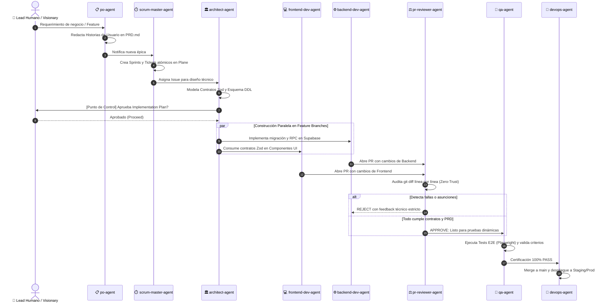

# 🏛️ Guía Maestra del Antigravity Squad: 10 Agentes Autónomos Especializados

El **Antigravity Squad** es la columna vertebral cognitiva de `@arcav-ia/flow`. Representa un cambio de paradigma frente a los asistentes de código tradicionales: en lugar de un único LLM monolítico intentando resolver todo al mismo tiempo, el Squad opera como un **equipo de ingeniería de 10 especialistas autónomos** con roles estrictos, contexto desacoplado y gobernanza Zero-Trust.

---

## 🎯 ¿Por qué es Vital el Squad?

1. **Eliminación de la Sobrecarga Cognitiva (Single Responsibility):**
   Un solo modelo que intenta diseñar arquitectura, escribir SQL, maquetar CSS, auditar seguridad y redactar tests satura su ventana de contexto (*context window*), alucina contratos y olvida reglas de negocio. Cada agente del Squad tiene un **dominio hiper-específico**.
2. **Separación de Poderes (Checks & Balances):**
   El agente que programa el feature (`frontend-dev-agent` o `backend-dev-agent`) **jamás es quien audita el Pull Request ni quien aprueba el merge**. El `pr-reviewer-agent` y el `qa-agent` actúan como auditores implacables e independientes.
3. **Especialización y Eficiencia de Modelos (Model Tiering):**
   - **Modelos Frontier con Thinking** (Claude Opus 4.6 Thinking, Gemini 3.1 Pro): Asignados a diseño arquitectónico, revisión de PRs y estrategia de producto.
   - **Modelos de Alta Velocidad** (Gemini 3.8 Flash): Asignados a tareas deterministas, automatizaciones, webhooks y testing rápido.
4. **Protocolo de Relevos Determinista (Handoff Flow):**
   Las tareas avanzan a través de una cadena de custodia estricta sin saltarse fases de calidad.

---

## 🔄 Organigrama y Flujo de Handoff del Squad



---

## 📋 Catálogo Técnico de los 10 Agentes

### 1. `architect-agent` (Arquitecto Principal)
- **Misión:** Diseñar la base estructural y técnica del sistema antes de escribir una sola línea de código de producto.
- **Regla Innegociable:** **No escribe código de producción (ni frontend ni backend)**. Gobierna contratos, esquemas y topología.
- **Entregables:**
  - Contratos Zod en runtime (`packages/contracts`).
  - Esquemas DDL de base de datos y políticas de seguridad (RLS).
  - Escenarios BDD en sintaxis Gherkin (`Given-When-Then`).
  - Planes de implementación (`implementation_plan.md`).
- **Modelo Recomendado:** `claude-opus-4-6-thinking` / `gemini-3.1-pro-high`.

---

### 2. `pr-reviewer-agent` (Juez de Código / Tech Lead QA)
- **Misión:** Proteger la rama `main` en Trunk-Based Development. Audita los Pull Requests buscando brechas de seguridad, discrepancias de contratos o anti-patrones.
- **Regla Innegociable:** Solo emite veredictos mecánicos en JSON estructurado:
  ```json
  {
    "decision": "APPROVE | REJECT",
    "reason": "Explicación técnica concisa para el pipeline"
  }
  ```
- **Entregables:** Comentarios exhaustivos en PRs de GitHub y bloqueos de seguridad en CI.
- **Modelo Recomendado:** `gemini-3.1-pro-high` / `claude-opus-4-6-thinking`.

---

### 3. `po-agent` (Product Owner)
- **Misión:** Custodiar la visión del producto, entender las necesidades del usuario final y traducir reglas de negocio a requerimientos claros.
- **Regla Innegociable:** Ninguna funcionalidad existe si no está documentada en `PRD.md` o en los issues de Plane.
- **Entregables:** Documentos de visión (`PRD.md`), criterios de aceptación y priorización de backlog.
- **Modelo Recomendado:** `claude-opus-4-6-thinking` / `gemini-3.1-pro-high`.

---

### 4. `scrum-master-agent` (Scrum Master & Trazabilidad)
- **Misión:** Garantizar el ritmo ágil, sincronizar los estados de tareas y proteger la velocidad del equipo.
- **Regla Innegociable:** Jamás permite tickets huérfanos sin Sprint/Cycle en Plane; todo trabajo debe ser medible en el burndown.
- **Entregables:** `sprint_actual.md`, sincronización de Plane (Issues, Cycles, Modules) y métricas de entrega.
- **Modelo Recomendado:** `gemini-3.1-pro-high`.

---

### 5. `designer-agent` (UI/UX Designer & Craft Floor)
- **Misión:** Diseñar la experiencia visual, jerarquías de interfaz y tokens de diseño bajo el motor **Impeccable**.
- **Regla Innegociable:** Cero emojis unicode en UI, contraste WCAG 2.1 AA estricto, touch targets ≥ 48px y cero *AI-Slop*.
- **Entregables:** `DESIGN.md`, especificaciones de layout, tokens CSS y auditorías visuales.
- **Modelo Recomendado:** `gemini-3.1-pro-high` (con capacidades de visión).

---

### 6. `frontend-dev-agent` (Desarrollador Frontend)
- **Misión:** Construir las interfaces web y móviles consumiendo estrictamente los contratos definidos por el arquitecto.
- **Regla Innegociable:** Solo lee contratos, nunca los modifica. Debe certificar 0 anti-patrones con `pnpm run check:design` antes de abrir PR.
- **Entregables:** Componentes React/Next.js, páginas Astro, islas SolidJS y estilos Tailwind.
- **Modelo Recomendado:** `gemini-3.1-pro-high` / `claude-sonnet-4-6`.

---

### 7. `backend-dev-agent` (Desarrollador Backend)
- **Misión:** Implementar la lógica de negocio, persistencia, APIs y seguridad en base de datos.
- **Regla Innegociable:** Toda función `SECURITY DEFINER` debe fijar `SET search_path = public, pg_temp;`. Todo payload externo debe validarse con Zod `safeParse`.
- **Entregables:** Migraciones SQL en Supabase/Postgres, RPCs seguras, políticas RLS y endpoints.
- **Modelo Recomendado:** `gemini-3.1-pro-high` / `claude-sonnet-4-6`.

---

### 8. `qa-agent` (QA & Automation Tester)
- **Misión:** Encontrar fallas, vulnerabilidades y regresiones. Actúa como el crítico más severo del código construido.
- **Regla Innegociable:** **Encuentra fallas, nunca las arregla**. Si un test falla, reporta el bug al desarrollador correspondiente; no toca código de producto.
- **Entregables:** Tests E2E en Playwright (Page Object Model), suites de integración y `bug_report.md`.
- **Modelo Recomendado:** `gemini-3.8-flash` / `gemini-3.1-pro-high`.

---

### 9. `devops-agent` (DevOps & Plataforma)
- **Misión:** Mantener la infraestructura, optimizar los pipelines de CI/CD y asegurar despliegues reproducibles.
- **Regla Innegociable:** Si el build estático (`npm run build`) o los tests fallan, el pipeline debe abortar inmediatamente.
- **Entregables:** Workflows de GitHub Actions, Dockerfiles, configuración Turborepo y scripts de deploy.
- **Modelo Recomendado:** `gemini-3.1-pro-high`.

---

### 10. `automation-agent` (Automatizaciones & Webhooks)
- **Misión:** Integrar flujos de trabajo externos, webhooks HTTP, proveedores de mensajería (WhatsApp/Evolution API) y nodos de n8n.
- **Regla Innegociable:** Todo webhook entrante debe autenticarse mediante firmas o tokens secretos y respetar límites de tasa (*rate limits*).
- **Entregables:** Flujos n8n versionados en JSON, scripts de sincronización y webhooks defensivos.
- **Modelo Recomendado:** `gemini-3.8-flash`.

---

## 📊 Matriz RACI de Responsabilidades

| Etapa del Ciclo | Humano | PO | Scrum | Architect | Devs (FE/BE) | Reviewer | QA | DevOps |
|---|:---:|:---:|:---:|:---:|:---:|:---:|:---:|:---:|
| **1. Definición de Requerimientos** | **A** | **R** | I | C | I | I | I | I |
| **2. Creación de Sprint & Tickets** | I | C | **R** | C | I | I | I | I |
| **3. Diseño de Contratos Zod & DDL** | **A** | C | I | **R** | C | C | C | I |
| **4. Implementación en Feature Branch** | I | I | I | C | **R** | I | I | I |
| **5. Auditoría de Pull Request** | I | I | I | C | I | **R / A** | I | I |
| **6. Pruebas Dinámicas E2E** | I | I | I | I | I | I | **R** | I |
| **7. Merge y Despliegue** | **A** | I | I | I | I | I | C | **R** |

> **R** = Responsable (hace el trabajo) | **A** = Aprobador (rinde cuentas) | **C** = Consultado | **I** = Informado

---

## 💻 Cómo Invocar a los Agentes en tu Flujo

### 1. Desde Antigravity CLI (`agy`):
```bash
# Lanzar sesión directamente con un agente específico:
agy --agent architect-agent
agy --agent pr-reviewer-agent
agy --agent frontend-dev-agent
```

### 2. Dentro de una Sesión Activa de Chat / IDE:
```text
/agent architect-agent Diseña los contratos Zod para el checkout con PIX
/agent pr-reviewer-agent Audita el diff contra main antes de abrir el PR
/agent qa-agent Escribe los tests E2E con Playwright para el nuevo catálogo
```

### 3. Delegación y Subagentes:
Cualquier agente puede invocar a otro como subagente en segundo plano (usando `invoke_subagent`), manteniendo su contexto limpio y recibiendo únicamente el reporte final sintetizado.
