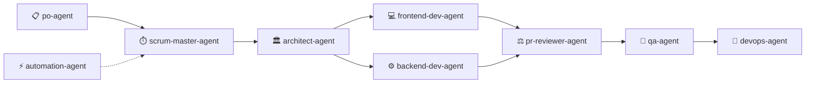

<div align="center">

# ⚡ @arcav-ia/flow ⚡
### Universal CLI & GitHub Template for Antigravity Agentic Architecture
**El Squad de 10 Agentes • 8 Core Skills Maestras • Gobernanza Zero-Trust • Diagnóstico Doctor**

[](https://github.com/arcavcwb/arcav-ia-flow)
[](https://www.npmjs.com/package/@arcav-ia/flow)
[](LICENSE)
[](https://nodejs.org/)
[](#)

</div>

---

## 🎯 ¿Qué es `@arcav-ia/flow`?

**`@arcav-ia/flow`** es la herramienta oficial de andamiaje (scaffolding) y gobernanza para equipos y desarrolladores que operan con **Google Antigravity**, Cursor, Windsurf y agentes autónomos de IA.

Permite transformar **cualquier repositorio (nuevo o existente)** en un entorno agéntico de élite en **menos de 3 segundos**, inyectando automáticamente el **Trinomio de Calidad**:
1. **🤖 El Antigravity Squad (10 Agentes Especializados):** División de trabajo cognitivo con Single Responsibility y separación estricta de poderes (el que programa nunca audita ni aprueba su propio código).
2. **🧠 Las 8 Skills Maestras Canónicas:** Protocolos especializados de UI/UX Impeccable, optimización de tokens Caveman, arquitectura lean Ponytail, contratos Zod, performance web y testing E2E determinista.
3. **🏛️ Gobernanza Zero-Trust & Modos Duales:** Reglas de cero asunción, anclaje anti-olvido y elección entre **Modo Operativo** (Git-First) o **Modo Enterprise** (Plane.so + Scrum).

---

## 🚀 Inicio Rápido (5 Segundos)

### 1. Inyectar en un Proyecto Existente (Recomendado)
Abre tu terminal en la carpeta de tu proyecto y ejecuta:

```bash
# Vía NPX directo desde GitHub (Inmediato, sin registros):
npx github:arcavcwb/arcav-ia-flow init

# O vía registro oficial NPM:
npx @arcav-ia/flow init
```

### 2. Crear un Proyecto Nuevo desde Cero
```bash
npx @arcav-ia/flow mi-nuevo-proyecto
```

### 3. Usar como GitHub Template
Haz clic en el botón verde **[Use this template](https://github.com/arcavcwb/arcav-ia-flow/generate)** en la cabecera de este repositorio o con GitHub CLI:
```bash
gh repo create mi-proyecto --template arcavcwb/arcav-ia-flow --public
```

### 4. Instalador Shell One-Liner (para CI/CD o entornos sin Node)
```bash
curl -fsSL https://raw.githubusercontent.com/arcavcwb/arcav-ia-flow/main/install.sh | bash
```

---

## 🤖 El Antigravity Squad: 10 Agentes Autónomos Especializados

¿Por qué un equipo de 10 agentes en vez de un único chat monolítico?
- **Cero Sobrecarga Cognitiva:** Cada agente tiene un ámbito restringido y una única misión.
- **Separación de Poderes:** Quien programa (`frontend-dev-agent` o `backend-dev-agent`) **nunca** audita el PR (`pr-reviewer-agent`) ni valida los tests dinámicos (`qa-agent`).
- **Especialización de Modelos:** Razonamiento Frontier (Claude Opus 4.6 Thinking / Gemini 3.1 Pro) para Arquitectura y Revisión; modelos ultra-rápidos (Gemini 3.8 Flash) para automatizaciones y pruebas.



| Agente | Rol y Responsabilidad | Modelo Recomendado |
|---|---|---|
| **`architect-agent`** | Diseña topología, esquemas DDL y contratos Zod. No escribe UI ni APIs. | Frontier (Thinking) |
| **`pr-reviewer-agent`** | Juez de código adversarial. Audita `git diff` contra contratos y PRD. Emite JSON (`APPROVE`/`REJECT`). | Frontier (Gemini Pro) |
| **`po-agent`** | Custodia la visión de producto, historias de usuario y criterios en `PRD.md`. | Frontier / Pro |
| **`scrum-master-agent`** | Sincronización ágil en Plane.so (Issues, Cycles, Burndown) y `sprint_actual.md`. | Pro / Balanced |
| **`designer-agent`** | Design System, tokens y auditoría visual Impeccable (0 emojis, WCAG AA, 48px). | Pro (Vision) |
| **`frontend-dev-agent`** | Construcción de interfaces Next.js/Astro consumiendo contratos sin modificarlos. | Pro / High |
| **`backend-dev-agent`** | Lógica de persistencia, RLS, RPCs security definer y esquemas Zod en runtime. | Pro / High |
| **`qa-agent`** | Automatización E2E (Playwright) y reportes de fallas. Encuentra bugs, nunca arregla código. | Flash / Fast |
| **`devops-agent`** | Infraestructura, GitHub Actions, Vercel, Docker y optimización de caché Turborepo. | Pro / Balanced |
| **`automation-agent`** | Automatizaciones externas, webhooks HTTP e integraciones WhatsApp/n8n. | Flash / Fast |

> 📖 **Consulta el manual completo del Squad y protocolo de handoff en [docs/SQUAD_GUIDE.md](docs/SQUAD_GUIDE.md).**

---

## 🧠 Las 8 Skills Maestras Preinstaladas

Todas las skills residen en `.agents/skills/` y se activan automáticamente según el contexto de la tarea:

```
.agents/skills/
├── impeccable/               # 🎨 UI/UX craft floor, WCAG 2.1 AA, 0 emojis unicode
├── caveman/                  # ⚡ Reducción de gasto de tokens (40-70% ahorro)
├── ponytail/                 # ✂️ Escalera YAGNI y erradicación de sobre-ingeniería
├── contract-first-api/       # 📜 Modelado Zod defensivo en runtime (safeParse)
├── vite-modernizer/          # ⚡ Migración limpia hacia Vite + TypeScript
├── web-vitals-heavy-media/   # 🚀 Optimización Core Web Vitals (LCP, CLS, INP)
├── pnpm-monorepo-architect/  # 🏗️ Gobernanza pnpm workspaces + Turborepo
└── playwright-e2e-suite/     # 🎭 Testing E2E determinista multi-viewport
```

> 📖 **Consulta el catálogo completo de skills en [docs/SKILLS_GUIDE.md](docs/SKILLS_GUIDE.md).**

---

## ⚖️ Modos de Trabajo: ¿Cuál Elegir?

Durante la inicialización, el CLI te permite elegir el modo adecuado para tu flujo:

| Característica | 🟢 Modo Operativo (Default) | 🔵 Modo Enterprise |
|---|---|---|
| **Filosofía** | Git-First, máxima agilidad, lean | Trazabilidad corporativa estricta |
| **Gestión de Tareas** | `task.md` local + Pull Requests | Plane.so (Issues, Cycles, Sprints) |
| **Dependencias Externas** | Cero (sólo Git y tu editor) | Requiere API Key y Workspace en Plane |
| **Ideal para** | MVPs, startups, microservicios, open-source | Proyectos corporativos y equipos multi-agente |
| **Flag CLI** | `--mode operative` | `--mode enterprise` |

---

## 🩺 Antigravity Doctor (`--doctor`)

Verifica en cualquier momento que tu entorno cumpla con todos los estándares agénticos:

```bash
npx @arcav-ia/flow --doctor
```

### Salida de Diagnóstico:
```text
🩺 Ejecutando Antigravity Doctor en: /mi-proyecto

  ✓ Repositorio Git detectado e inicializado
  ✓ GitHub CLI (gh) autenticado como: @tu-usuario
  ✓ Entorno de ejecución: Node.js v24.12.0
  ✓ Archivo .env presente
  ✓ Todas las skills maestras presentes (8/8)
  ✓ Todos los agentes del Squad presentes (10/10)
  ✓ Script 'check:design' configurado en package.json
  ✓ Reglas de gobernanza y AGENTS.md sincronizados

✨ Todo en orden. Tu entorno agéntico está 100% operativo.
```

---

## 📁 Estructura Inyectada en tu Proyecto

```
tu-proyecto/
├── .agents/
│   ├── agents/                   # 🤖 Los 10 Agentes Especializados del Squad
│   │   ├── architect-agent/
│   │   ├── pr-reviewer-agent/
│   │   ├── po-agent/
│   │   ├── scrum-master-agent/
│   │   ├── designer-agent/
│   │   ├── frontend-dev-agent/
│   │   ├── backend-dev-agent/
│   │   ├── qa-agent/
│   │   ├── devops-agent/
│   │   └── automation-agent/
│   ├── rules/
│   │   └── superules.md          # 🏛️ Reglas obligatorias de gobernanza y Zero-Trust
│   ├── skills/                   # 🧠 Las 8 Core Skills maestras
│   └── mcp_config.json           # 🔌 Servidores MCP preconfigurados
├── docs/
│   └── walkthroughs/             # 📝 Registro de entregas y evidencias técnicas
├── AGENTS.md                     # 🤖 Contexto global para el equipo de agentes
├── task.md                       # 📋 Checklist de trabajo con anclaje anti-olvido
├── .env.example                  # 🔐 Plantilla de variables de entorno
└── package.json                  # 📦 Incluye script "check:design"
```

---

## 📚 Documentación Técnica Adicional

- [Guía Maestra del Squad](docs/SQUAD_GUIDE.md) — Fichas técnicas de los 10 agentes, matriz RACI y handoff.
- [Catálogo Detallado de Skills](docs/SKILLS_GUIDE.md) — Explicación profunda de cada skill y sus reglas.
- [Gobernanza y Filosofía Zero-Trust](docs/GOVERNANCE.md) — Estándares de Git Flow, regla anti-olvido y ciclo de PRs.
- [Arquitectura Interna del CLI](docs/ARCHITECTURE.md) — Cómo funciona el motor de inyección zero-dependency.

---

## 📄 Licencia

Distribuido bajo la Licencia **MIT**. Consulta [LICENSE](LICENSE) para más información.

<div align="center">
Desarrollado con ❤️ por <b>Arcav IA</b> para la comunidad de desarrolladores agénticos.
</div>
