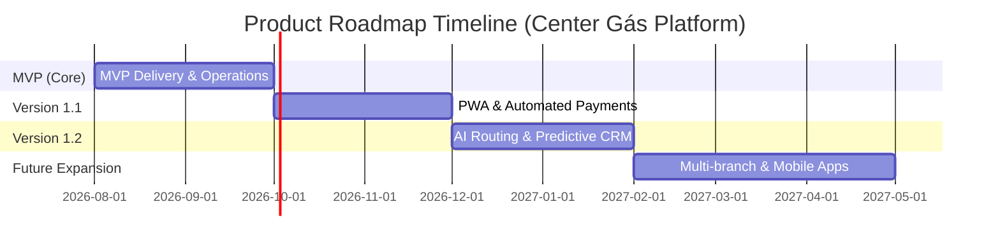

# Plane Product Roadmap

## Product Roadmap Overview

---

## Releases & Phases Detail

### Phase 1: MVP - Core Digital Transformation (4 Sprints: 2026-08-01 a 2026-09-25)
* **Goal:** Digitizar la toma de pedidos, centralizar el despacho en Kanban, proveer vista a motoboys y automatizar fidelidad 8->1.
* **Included Epics:**
  * `EPIC-01`: Módulo de Autogestión de Clientes
  * `EPIC-02`: Panel de Gestión de Pedidos y Despacho
  * `EPIC-03`: CRM y Fidelización Automática
  * `EPIC-04`: Interfaz de Repartidores
  * `EPIC-05`: Integraciones y Automatización n8n/WhatsApp
* **Key KPI:** 100% de pedidos atendidos digitalmente sin intervención telefónica manual.

### Phase 2: Version 1.1 - PWA & Payment Automation (Q4 2026)
* **Goal:** Mejorar la experiencia offline para repartidores e integrar cobros PIX automáticos.
* **Included Features:**
  * Support PWA Offline First (`TD-001`).
  * Cobro automático por PIX dinámico in-app (`TD-003`).
  * Control estricto de cascos vacíos en stock (`TD-005`).

### Phase 3: Version 1.2 - AI Routing & Predictive CRM (Q1 2027)
* **Goal:** Optimizar rutas de entrega y disparar ventas recurrentes proactivas.
* **Included Features:**
  * Asignación automática por cercanía de motoboy (`TD-002`).
  * Campañas de reorden predictivo a los 40 días (`TD-004`).

### Phase 4: Future Expansion (2027+)
* **Goal:** Escalar el modelo a nuevas sucursales en Curitiba.
* **Included Ideas:**
  * Plataforma multi-sucursal.
  * Aplicaciones nativas publicadas en App Store y Google Play.
